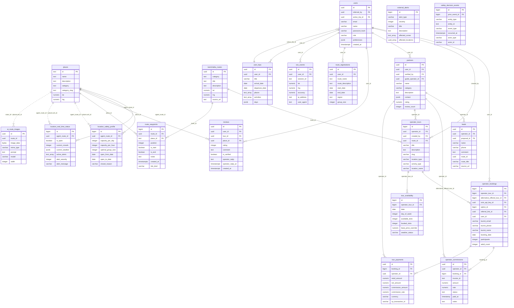

# Схема базы данных Ведара

> Снято 2026-09-10 с настоящего PostgreSQL 16.13 (Ubuntu 16.13-0ubuntu0.24.04.1): baseline прода (`lib/database/baseline/schema-baseline.sql`, снимок 2026-08-15) + миграции новее него, накатанные штатным раннером. Последняя миграция в снимке: `948_hide_sivuchi_wrong_coords.sql`.
> Файл порождён `scripts/gen-db-schema.ts` (`npm run db:schema-doc`); править руками бессмысленно — следующий прогон перепишет.
> Что здесь НЕ учтено: дрейф прода после baseline, не отражённый миграциями. Судья дрейфа — `GET /api/cron/schema-drift` на проде (`lib/db/schema-drift.ts`). Значений данных в файле нет — только имена и типы.

| Что | Сколько |
|---|---:|
| Таблиц | 238 |
| Представлений (VIEW) | 10 |
| Колонок | 3159 |
| Внешних ключей | 255 |
| Таблиц без единого FK в обе стороны | 70 |

Обозначения в списках колонок: `!` — NOT NULL, `=` — есть DEFAULT, `PK` — первичный ключ, `→` — внешний ключ.

## Домены

| Домен | Таблиц | Таблицы |
|---|---:|---|
| [Платежи и деньги](#платежи-и-деньги) | 10 | `affiliate_clicks` `affiliate_payouts` `agent_commissions` `agent_market_payments` `commission_payouts` `operator_commissions` `operator_payouts` `refund_requests` `tour_payments` `transfer_transactions` |
| [Безопасность](#безопасность) | 17 | `danger_assessments` `emergency_contacts` `external_alerts` `mchs_group_registrations` `mchs_registrations` `route_registration_notifications` `route_registrations` `safety_alerts` `safety_checkins` `safety_decision_events` `safety_source_health` `sos_events` `tourist_incidents` `volcano_status` `weather_alert_bookings` `weather_alerts` `zone_capacity_limits` |
| [Точки, маршруты, карта](#точки-маршруты-карта) | 33 | `_agent_route_knowledge_legacy` `_route_description_cache_legacy` `activities` `ai_route_images` `collections` `crowd_log` `description_provenance` `kamchatka_routes` `location_real_time_status` `location_safety_profile` `parks` `place_aliases` `place_safety_reports` `places` `road_graph_edges` `road_graph_imports` `road_graph_nodes` `route_categories` `route_description_cache` `route_field_check_photos` `route_field_checks` `route_geometry_archive` `route_order_decisions` `route_passport_ocr` `route_source_checks` `route_subcategories` `route_tags` `route_templates` `route_track_imports` `route_waypoints` `trail_report_photos` `trail_reports` `user_place_photos` |
| [Туры и брони](#туры-и-брони) | 29 | `booking_change_requests` `booking_group_members` `booking_logs` `booking_transfers` `booking_waivers` `bookings` `cancellation_policies` `channel_orders` `contingency_rules` `octo_api_keys` `octo_booking_log` `octo_webhook_log` `operator_bookings` `operator_tour_reviews` `operator_tour_tags` `operator_tours` `promo_codes` `tour_assets` `tour_availability` `tour_availability_alternatives` `tour_departures` `tour_options` `tour_pricing_rules` `tour_selection_events` `tour_selection_items` `tour_selections` `tour_transfer_requests` `tours` `uon_sync_log` |
| [Люди и доступ](#люди-и-доступ) | 27 | `accounts` `audit_log` `audit_logs` `max_login_sessions` `official_registry_operators` `operator_ai_actions` `operator_ai_config` `operator_applications` `operator_settings` `operator_signups` `operator_site_audits` `operator_staff` `operator_stats_cache` `operator_vehicles` `partner_assets` `partner_integrations` `partner_prospects` `partners` `referrals` `security_blocks` `sessions` `tourist_documents` `tourist_profiles` `user_role_history` `user_sessions` `users` `verification_tokens` |
| [Гиды](#гиды) | 6 | `guide_availability` `guide_certifications` `guide_earnings` `guide_groups` `guide_reviews` `guide_schedule` |
| [Жильё, снаряжение, трансферы](#жильё-снаряжение-трансферы) | 20 | `accommodation_assets` `accommodation_availability` `accommodation_bookings` `accommodation_reviews` `accommodation_rooms` `accommodations` `driver_documents` `driver_schedules` `drivers` `gear_availability` `gear_items` `gear_rentals` `transfer_fleet_vehicles` `transfer_reviews` `transfer_routes` `transfer_seat_bookings` `transfer_trips` `transfers` `vehicle_documents` `vehicles` |
| [Турагенты (роль agent)](#турагенты-роль-agent) | 4 | `agent_bookings` `agent_clients` `agent_referral_events` `agent_referral_links` |
| [Лиды и продажи](#лиды-и-продажи) | 9 | `client_communications` `funnel_events` `lead_activity_log` `lead_followups` `lead_proposals` `leads` `outreach_queue` `sales_campaigns` `sales_outreach_log` |
| [Кузьмич, чат, RAG](#кузьмич-чат-rag) | 22 | `chat_messages` `chat_sessions` `conversation_messages` `conversation_participants` `conversations` `knowledge_base_articles` `kuzmich_engagement_signals` `llm_usage_log` `mcp_clients` `mcp_handoff_events` `mcp_handoffs` `mcp_tool_calls` `mcp_write_attempts` `message_templates` `query_expansion_log` `rag_feedback` `rag_quality_log` `tg_booking_flow` `tg_conversations` `tg_operator_groups` `tg_ratings` `user_ai_memory` |
| [AI-агенты, эволюция, ядро](#ai-агенты-эволюция-ядро) | 27 | `agent_actions` `agent_approvals` `agent_effects` `agent_events` `agent_experiments` `agent_knowledge` `agent_knowledge_links` `agent_memory` `agent_memory_edits` `agent_run_history` `agent_sdk_sessions` `agent_tasks` `agent_tools` `ai_actions_log` `approval_execution_log` `board_meeting_sessions` `cron_leases` `evo_agent_state` `evo_evolution_log` `evo_feedback` `evo_growth_issues` `evo_growth_scans` `evo_review_ledger` `external_tools` `intelligence_sources` `legislation_docs` `stakeholder_wishes` |
| [Эко и лояльность](#эко-и-лояльность) | 10 | `eco_achievements` `eco_balances` `eco_compensation_claims` `eco_ledger` `eco_points` `loyalty_levels` `loyalty_transactions` `user_achievements` `user_eco_activities` `user_eco_points` |
| [Контент, уведомления, поездки туриста](#контент-уведомления-поездки-туриста) | 21 | `articles` `assets` `email_templates` `faqs` `notification_log` `notification_preferences` `notifications` `page_views` `platform_settings` `push_subscriptions` `pwa_installs` `review_assets` `reviews` `smart_notifications_log` `support_tickets` `system_settings` `trip_preparation_events` `trip_preparation_items` `trip_preparation_plans` `trip_preparation_shares` `user_trips` |
| [Служебные](#служебные) | 2 | `_migration_failures` `_migrations` |
| [Прочее](#прочее) | 1 | `model_catalog` |

## ER-диаграмма ядра (две дороги туриста)

Сплошная линия — внешний ключ в базе. Пунктир — связь, которую держит только код (без FK): база её не охраняет, и сирота возможна.

## Платежи и деньги

Приём оплаты — `app/api/payments/*` (§7, не трогать). Комиссия начисляется только `recordCommissionFromBooking()`.

**affiliate_clicks** · 8 кол. · PK id · индексов 3

`id uuid!=` `partner varchar!` `source varchar!` `sub_id varchar` `referrer varchar` `ip_addr varchar` `clicked_at timestamptz=` `created_at timestamptz=`

**affiliate_payouts** · 9 кол. · PK id · индексов 4

`id uuid!=` `partner varchar!` `amount numeric!` `currency varchar=` `status varchar=` `tp_click_id varchar` `received_at timestamptz=` `paid_at timestamptz` `created_at timestamptz=`

**agent_commissions** · 11 кол. · PK id · agent_id → users.id, booking_id → agent_bookings.id · индексов 4

`id uuid!=` `agent_id uuid!` `booking_id uuid!` `amount numeric!` `rate numeric!` `status varchar!=` `paid_at timestamp` `payout_reference varchar` `notes text` `created_at timestamp=` `updated_at timestamp=`

**agent_market_payments** · 12 кол. · PK id · индексов 5

`id uuid!=` `payment_id varchar!=` `query_type varchar!=` `query_params jsonb!=` `price_usdt numeric!=` `wallet_to text!` `tx_id text` `status varchar!=` `expires_at timestamptz!=` `created_at timestamptz!=` `confirmed_at timestamptz` `confirmed_by text`

**commission_payouts** · 9 кол. · PK id · agent_id → users.id · индексов 3

`id uuid!=` `agent_id uuid!` `total_amount numeric!` `status varchar!=` `payment_method varchar` `payout_date timestamp` `notes text` `created_at timestamp=` `updated_at timestamp=`

**operator_commissions** · 11 кол. · PK id · booking_id → operator_bookings.id, operator_id → partners.id · индексов 6

`id uuid!=` `operator_id uuid!` `booking_id bigint` `invoice_id text!` `amount numeric!` `rate numeric!=` `status text!=` `paid_at timestamp` `notes text` `created_at timestamp=` `updated_at timestamp=`

**operator_payouts** · 17 кол. · PK id · created_by → users.id, operator_id → partners.id · индексов 3

`id uuid!=` `operator_id uuid!` `total_net numeric!` `booking_count integer!=` `currency varchar!=` `payment_ids uuid[]!=` `cp_payout_id varchar` `payout_method varchar` `payout_details jsonb` `status varchar!=` `failure_reason text` `period_start date!` `period_end date!` `paid_at timestamp` `payment_reference varchar` `created_at timestamp=` `created_by uuid`

**refund_requests** · 15 кол. · PK id · booking_id → operator_bookings.id, initiated_by → operator_staff.id, partner_id → partners.id · на неё ссылаются: booking_change_requests · индексов 3

`id integer!=` `partner_id uuid!` `booking_id integer!` `booking_amount numeric!` `refund_percent numeric!` `refund_amount numeric!` `reason text` `days_before_tour integer` `cp_transaction_id text` `cp_refund_id text` `status text!=` `error_message text` `initiated_by integer` `created_at timestamptz!=` `completed_at timestamptz`

**tour_payments** · 20 кол. · PK id · booking_id → operator_bookings.id, operator_id → partners.id · индексов 6

`id uuid!=` `booking_id bigint!` `operator_id uuid!` `retail_amount numeric!` `net_amount numeric!` `commission_amount numeric!` `commission_rate numeric!` `currency varchar!=` `cp_transaction_id varchar` `cp_invoice_id varchar` `cp_payment_method varchar` `status varchar!=` `paid_at timestamp` `release_after timestamp` `released_at timestamp` `refunded_at timestamp` `refund_amount numeric` `refund_reason text` `created_at timestamp=` `updated_at timestamp=`

**transfer_transactions** · 14 кол. · PK id · driver_id → drivers.id, operator_id → partners.id, transfer_id → transfers.id, vehicle_id → vehicles.id · индексов 5

`id uuid!=` `operator_id uuid!` `type varchar!` `amount numeric!` `currency varchar=` `description text` `date date!` `transfer_id uuid` `driver_id uuid` `vehicle_id uuid` `payment_method varchar` `reference_number varchar` `notes text` `created_at timestamptz=`

## Безопасность

SOS пишет `sos_events` (`app/api/safety/sos`, §7). Внешние сигналы (сейсмика, МЧС, пожары) — `external_alerts`; журнал решений конвейера — `safety_decision_events` (append-only, триггер).

**danger_assessments** · 18 кол. · PK id · индексов 3

`id bigint!=` `zone text!` `assessed_at timestamptz!=` `expires_at timestamptz!` `risk_score integer!` `risk_level text!` `threat_types text[]!=` `tourists_at_risk integer!=` `active_tours_count integer!=` `confidence numeric` `similar_event text` `recommended_action text` `analysis_text text!` `seismic_events_count integer=` `volcanic_alerts_count integer=` `max_magnitude numeric` `max_ash_height_m integer` `created_at timestamptz!=`

**emergency_contacts** · 16 кол. · PK id · индексов 3

`id bigint!=` `zone varchar` `contact_type varchar` `name varchar` `phone varchar` `location_lat numeric` `location_lng numeric` `service_hours text` `capabilities text[]` `updated_at timestamp=` `purpose varchar` `source varchar` `source_url text` `verified_at timestamptz` `verified_by text` `notes text`

**external_alerts** · 16 кол. · PK id · индексов 3

`id bigint!=` `alert_type varchar` `severity integer` `title varchar` `description text` `affected_zones text[]` `affected_locations uuid[]=` `created_at timestamp=` `expires_at timestamp` `source_url varchar` `external_id varchar` `updated_at timestamp=` `push_sent_at timestamptz` `magnitude numeric` `lat numeric` `lng numeric`

**mchs_group_registrations** · 19 кол. · PK id · operator_partner_id → partners.id, operator_user_id → users.id · индексов 4

`id uuid!=` `operator_partner_id uuid` `operator_user_id uuid` `group_name text!` `group_members jsonb!=` `route_description text!` `route_region text` `start_date date!` `end_date date!` `guide_contact jsonb!=` `emergency_contacts jsonb!=` `participant_count integer!=` `status varchar!=` `mchs_request_id text` `mchs_response jsonb` `last_error text` `submitted_at timestamptz` `created_at timestamptz!=` `updated_at timestamptz!=`

**mchs_registrations** · 13 кол. · PK id · booking_id → bookings.id, operator_id → partners.id · индексов 5

`id uuid!=` `booking_id uuid` `operator_id uuid` `group_composition jsonb!` `route text!` `start_date date!` `end_date date!` `guide_contacts jsonb!` `emergency_contacts jsonb!` `status varchar=` `mchs_reference text` `created_at timestamptz=` `updated_at timestamptz=`

**route_registration_notifications** · 9 кол. · PK id · registration_id → route_registrations.id · индексов 2

`id uuid!=` `registration_id uuid` `step integer!` `channel varchar!` `recipient text!` `status varchar=` `error_message text` `sent_at timestamptz` `created_at timestamptz=`

**route_registrations** · 33 кол. · PK id · user_id → users.id · на неё ссылаются: route_registration_notifications · индексов 7

`id uuid!=` `user_id uuid` `route_name text!` `route_description text` `start_date date!` `end_date date!` `region text!=` `group_size integer!` `group_members jsonb` `leader_name text!` `leader_phone text!` `leader_email text` `emergency_contact_name text!` `emergency_contact_phone text!` `emergency_contact_relation text` `emergency_contact_telegram_chat_id bigint` `emergency_contact_email text` `emergency_contact_consent boolean=` `emergency_contact_consent_at timestamptz` `mchs_status varchar=` `mchs_reference text` `submitted_at timestamptz` `completed_at timestamptz` `created_at timestamptz=` `updated_at timestamptz=` `expected_return_at timestamptz` `trip_kind varchar=` `last_position_lat numeric` `last_position_lng numeric` `last_position_at timestamptz` `checkin_confirmed_at timestamptz` `reminder_sent boolean!=` `mchs_informed_at timestamptz`

**safety_alerts** · 12 кол. · PK id · created_by → users.id · индексов 3 · триггеры: trg_safety_alerts_updated_at

`id uuid!=` `zone varchar!` `severity varchar!` `title varchar!` `message text!` `source varchar!=` `active_from timestamptz!=` `active_until timestamptz` `is_active boolean!=` `created_by uuid` `created_at timestamptz!=` `updated_at timestamptz!=`

**safety_checkins** · 5 кол. · PK id · индексов 3

`id uuid!=` `zone varchar` `lat float8` `lng float8` `created_at timestamptz!=`

**safety_decision_events** · 14 кол. · PK id · prior_event_id → safety_decision_events.id · индексов 4 · триггеры: trg_safety_decision_events_append_only

`id bigint!=` `entity_type varchar!=` `entity_id text` `event_type varchar!` `occurred_at timestamptz!=` `actor_type varchar!` `actor_id varchar` `source_url text` `source_published_at timestamptz` `payload_hash varchar` `prior_event_id bigint` `decision_reason text` `details jsonb!=` `created_at timestamptz!=`

**safety_source_health** · 10 кол. · PK source_key · индексов 1

`source_key text!` `label text` `last_run_at timestamptz` `last_status text` `raw_items integer=` `inserted integer=` `last_nonempty_at timestamptz` `last_alerted_at timestamptz` `updated_at timestamptz=` `first_seen_at timestamptz`

**sos_events** · 20 кол. · PK id · user_id → users.id · индексов 4

`id uuid!=` `user_id uuid` `session_id text` `lat numeric` `lng numeric` `accuracy numeric` `ip_address inet` `user_agent text` `status varchar!=` `notes text` `created_at timestamptz!=` `tourist_name text` `tourist_phone text` `message text` `emergency_type text` `source varchar!=` `relayed_by text` `origin_class text` `outcome text` `outcome_at timestamptz`

**tourist_incidents** · 15 кол. · PK id · индексов 3

`id integer!=` `slug varchar!` `incident_date date!` `title text!` `location_name text!` `location_type varchar=` `casualties integer!=` `injured integer!=` `description text!` `cause text!` `lessons text[]!=` `mchs_involved boolean=` `source_url text` `related_ark_id uuid` `created_at timestamptz=`

**volcano_status** · 12 кол. · PK id · place_ark_id → places.ark_id · индексов 3

`id uuid!=` `place_ark_id uuid` `volcano_name text!` `name_normalized text!` `aviation_color_code text!=` `activity_level text` `ash_height_m integer` `summary text` `source_url text` `source_name text=` `observed_at timestamptz` `updated_at timestamptz!=`

**weather_alert_bookings** · 2 кол. · PK alert_id, booking_id · alert_id → weather_alerts.id, booking_id → operator_bookings.id · индексов 2

`alert_id bigint!` `booking_id bigint!`

**weather_alerts** · 11 кол. · PK id · operator_tour_id → operator_tours.id · на неё ссылаются: weather_alert_bookings · индексов 4

`id bigint!=` `operator_tour_id bigint!` `location_name varchar` `alert_date date!` `alert_type varchar` `severity varchar` `weather_data jsonb` `processed boolean=` `processed_at timestamp` `action_taken varchar` `created_at timestamp=`

**zone_capacity_limits** · 7 кол. · PK id · индексов 3

`id uuid!=` `zone text!` `max_daily_visitors integer!` `reason text` `set_by text!=` `created_at timestamptz=` `updated_at timestamptz=`

## Точки, маршруты, карта

Три master-сущности: `places` (точка), `kamchatka_routes` (маршрут), связь — `route_waypoints` с родом `link_kind`. Читать маршруты наружу только через `v_kamchatka_routes_api`.

**_agent_route_knowledge_legacy** · 23 кол. · индексов 10

`id uuid!=` `route_dedupe_key text!` `route_id uuid` `category text!` `title text!` `description text` `lat numeric` `lng numeric` `source_url text` `source_name text` `search_text text!` `payload jsonb!=` `source_hash text!` `source_updated_at timestamptz` `last_synced_at timestamptz!=` `created_at timestamptz!=` `updated_at timestamptz!=` `is_visible boolean!=` `location_type text` `activity_type text` `kuzmich_review text` `zone varchar` `kind varchar!=`

**_route_description_cache_legacy** · 4 кол. · PK route_id · route_id → operator_tours.id · индексов 2

`route_id integer!` `description text!` `model text!=` `generated_at timestamptz!=`

**activities** · 8 кол. · PK id · индексов 2

`id uuid!=` `key text!` `title text!` `icon_bytes bytea` `icon_mime text` `icon_sha256 text` `icon_url text` `created_at timestamptz=`

**ai_route_images** · 19 кол. · PK id · индексов 5

`id uuid!=` `route_id uuid!` `image_data bytea` `mime_type varchar=` `prompt text` `model varchar=` `width integer=` `height integer=` `created_at timestamptz=` `photo_verified boolean` `ai_audit_reason text` `ai_audit_at timestamptz` `manually_reviewed boolean=` `source_url text` `author text` `license text` `license_url text` `s3_key text` `s3_url text`

**collections** · 20 кол. · PK id · created_by → users.id · индексов 5

`id uuid!=` `slug varchar!` `title varchar!` `description text` `cover_image text` `place_ids uuid[]!=` `route_ids uuid[]!=` `tags text[]!=` `is_public boolean!=` `created_by uuid` `view_count integer!=` `created_at timestamptz!=` `updated_at timestamptz!=` `rule_kind varchar` `rule_location_type varchar` `rule_activity_type varchar` `rule_difficulty varchar` `rule_query varchar` `rule_limit integer=` `accent varchar=`

**crowd_log** · 12 кол. · PK id · индексов 2

`id bigint!=` `agent_route_id uuid` `group_id uuid` `group_size integer` `guide_id uuid` `checkin_at timestamp` `checkout_at timestamp` `duration_hours integer` `incidents text` `guide_notes text` `safety_score integer` `created_at timestamp=`

**description_provenance** · 11 кол. · PK id · индексов 3

`id bigint!=` `entity_id uuid!` `entity_kind text!` `entity_title text` `written_by text!` `model text` `facts_given jsonb!=` `facts_count integer!=` `chars integer` `previous_chars integer` `written_at timestamptz!=`

**kamchatka_routes** · 52 кол. · PK id · на неё ссылаются: operator_tours, route_geometry_archive, route_passport_ocr, route_track_imports, route_waypoints, tours, transfer_trips, trip_preparation_plans · индексов 8 · триггеры: trg_archive_route_geometry, trg_route_version_geometry

`id uuid!=` `category text!` `title text!` `description text` `lat numeric` `lng numeric` `source_url text` `source_name text` `metadata jsonb!=` `dedupe_key text` `created_at timestamptz!=` `updated_at timestamptz!=` `slug text` `ark_id uuid` `activity_type varchar` `zone varchar` `geometry jsonb` `difficulty varchar` `pdf_url text` `season varchar` `route_type varchar` `hazards text[]` `equipment text[]` `registration_required boolean=` `flora_fauna text` `distance_km numeric` `elevation_gain_m integer` `duration_hours numeric` `accessibility text` `mchs_registration_required boolean=` `mchs_phone varchar` `park_name varchar` `park_approval_url text` `search_count integer!=` `is_visible boolean!=` `view_count integer!=` `kuzmich_review text` `embedding jsonb` `official_passport_url text` `passport_agency varchar` `passport_verified_at timestamptz` `surface_types text[]` `elevation_loss_m integer` `elevation_min_m integer` `elevation_max_m integer` `duration_days integer` `route_version integer!=` `merged_into_id text` `merged_at timestamptz` `difficulty_source varchar` `route_kind text` `route_kind_reason text`

**location_real_time_status** · 14 кол. · PK id · agent_route_id → places.ark_id · индексов 3

`id bigint!=` `agent_route_id uuid` `is_open boolean=` `current_crowds integer=` `current_weather jsonb` `active_alerts text[]=` `alert_severity integer=` `alert_message varchar` `alert_source varchar` `alert_expires_at timestamp` `tourists_today integer=` `tourists_hour integer=` `recommender_status varchar=` `updated_at timestamp=`

**location_safety_profile** · 28 кол. · PK id · agent_route_id → places.ark_id · индексов 2

`id bigint!=` `agent_route_id uuid` `capacity_per_day integer=` `capacity_per_hour integer=` `optimal_group_size integer=` `open_from_date date` `open_to_date date` `closed_reason varchar` `hazard_types text[]=` `difficulty_level integer=` `altitude_m integer` `terrain_type varchar` `road_type varchar=` `road_accessibility integer=` `altitude_diff_m integer` `distance_km numeric` `nearest_medical_km numeric` `emergency_access text` `phone_ranger_mches varchar` `sat_communicator_required boolean=` `rules_required text` `weather_threshold jsonb` `updated_at timestamp=` `required_gear text[]` `connectivity jsonb` `registration_required boolean!=` `medical_info text` `tsunami_risk boolean!=`

**parks** · 16 кол. · PK id · индексов 2

`id bigint!=` `slug varchar!` `display_name varchar!` `description text` `zone varchar` `mchs_phone varchar` `permit_url text` `search_term varchar!` `is_active boolean!=` `created_at timestamptz!=` `updated_at timestamptz!=` `permit_email varchar` `permit_office_address text` `permit_office_hours text` `permit_gosuslugi_url text` `permit_online_url text`

**place_aliases** · 5 кол. · PK id · индексов 5

`id uuid!=` `place_id text!` `alias text!` `source_name text` `created_at timestamptz!=`

**place_safety_reports** · 9 кол. · PK id · индексов 3

`id uuid!=` `place_id text!` `user_id uuid` `is_ok boolean!=` `conditions text[]!=` `note text` `reporter_lat numeric` `reporter_lng numeric` `created_at timestamptz!=`

**places** · 42 кол. · PK id · на неё ссылаются: location_real_time_status, location_safety_profile, reviews, route_waypoints, volcano_status · индексов 8

`id text!` `name text!` `description text` `category text` `category_slug text` `lat numeric!` `lng numeric!` `district text` `length_km numeric` `duration varchar` `difficulty varchar` `images jsonb=` `created_at timestamptz=` `ark_id uuid` `location_type varchar` `activity_type varchar` `zone varchar` `source_url text` `source_name varchar` `updated_at timestamptz=` `search_count integer!=` `is_visible boolean!=` `essence text` `photo_url text` `best_season text` `seasonal_notes jsonb` `access_info text` `eco_zone varchar` `eco_permit_required boolean=` `eco_rules text` `eco_permit_url text` `indigenous_info jsonb` `view_count integer!=` `dedupe_key text` `kuzmich_review text` `embedding jsonb` `merged_into_id uuid` `merged_at timestamptz` `geocode_failed_at timestamptz` `slug varchar` `coord_source varchar!=` `coord_source_at timestamptz`

**road_graph_edges** · 8 кол. · PK id · индексов 3

`id bigint!=` `from_node bigint!` `to_node bigint!` `length_m real!` `highway varchar!` `surface varchar` `name text` `geometry jsonb`

**road_graph_imports** · 7 кол. · PK id · индексов 1

`id bigint!=` `started_at timestamptz!=` `finished_at timestamptz` `nodes_count integer!=` `edges_count integer!=` `source text!=` `note text`

**road_graph_nodes** · 3 кол. · PK id · индексов 3

`id bigint!` `lat float8!` `lng float8!`

**route_categories** · 7 кол. · PK slug · на неё ссылаются: route_subcategories, route_tags · индексов 1

`slug varchar!` `name_ru varchar!` `name_en varchar` `icon varchar` `sort_order integer=` `is_active boolean=` `created_at timestamptz=`

**route_description_cache** · 4 кол. · PK route_id · route_id → operator_tours.id · индексов 1

`route_id integer!` `description text!` `model text!=` `generated_at timestamptz!=`

**route_field_check_photos** · 8 кол. · PK id · check_id → route_field_checks.id · индексов 2

`id uuid!=` `check_id uuid!` `mime varchar!` `bytes bytea` `byte_size integer!` `created_at timestamptz!=` `s3_url text` `s3_key text`

**route_field_checks** · 15 кол. · PK id · на неё ссылаются: route_field_check_photos · индексов 4

`id uuid!=` `target_kind varchar!` `target_id text` `verdict varchar!` `reported_lat numeric` `reported_lng numeric` `accuracy_m integer` `note text` `trip_tag varchar` `status varchar!=` `created_at timestamptz!=` `object_lat numeric` `object_lng numeric` `object_source varchar` `proposed_name text`

**route_geometry_archive** · 7 кол. · PK id · route_id → kamchatka_routes.id · индексов 2

`id bigint!=` `route_id uuid!` `geometry jsonb` `source text` `distance_km numeric` `vertices integer` `archived_at timestamptz!=`

**route_order_decisions** · 9 кол. · PK id · индексов 3

`id uuid!=` `route_id text!` `route_title text` `reason varchar!` `decision varchar!` `evidence text!` `note text` `decided_by text` `decided_at timestamptz!=`

**route_passport_ocr** · 7 кол. · PK route_id · route_id → kamchatka_routes.id · индексов 1

`route_id uuid!` `pdf_url text!` `markdown text!` `pages integer` `model varchar!=` `processed_at timestamptz!=` `enriched_at timestamptz`

**route_source_checks** · 13 кол. · PK route_id · индексов 3

`route_id uuid!` `verdict varchar!` `donor_url text` `geometry_hash text` `our_points integer` `their_points integer` `our_elevation boolean` `their_elevation boolean` `start_shift_m integer` `end_shift_m integer` `titles_agree boolean` `method_version integer!=` `checked_at timestamptz!=`

**route_subcategories** · 8 кол. · PK id · category_slug → route_categories.slug · индексов 3

`id integer!=` `category_slug varchar` `slug varchar!` `name_ru varchar!` `name_en varchar` `sort_order integer=` `is_active boolean=` `created_at timestamptz=`

**route_tags** · 9 кол. · PK id · category_slug → route_categories.slug · индексов 4

`id integer!=` `slug varchar!` `name_ru varchar!` `name_en varchar` `category_slug varchar` `tag_type varchar` `sort_order integer=` `is_active boolean=` `created_at timestamptz=`

**route_templates** · 28 кол. · PK id · индексов 8

`id uuid!=` `name varchar!` `description text!` `short_description text` `category varchar=` `difficulty varchar!` `duration integer!` `season jsonb=` `coordinates jsonb=` `requirements jsonb=` `included jsonb=` `not_included jsonb=` `is_active boolean=` `source varchar=` `source_external_id varchar` `dedupe_key varchar` `created_at timestamptz=` `updated_at timestamptz=` `subcategory varchar` `tags jsonb=` `district varchar` `length_km numeric` `activities jsonb=` `features jsonb=` `best_months varchar` `min_elevation integer` `max_elevation integer` `images jsonb=`

**route_track_imports** · 22 кол. · PK id · matched_route_id → kamchatka_routes.id · индексов 3

`id uuid!=` `source_name text` `format varchar!` `s3_url text!` `s3_key text!` `byte_size integer!` `points integer` `length_km numeric` `span_km numeric` `ele_share numeric` `step_min_m integer` `step_median_m integer` `step_max_m integer` `timespan_min integer` `waypoints integer!=` `matched_route_id uuid` `off_by_km numeric` `problems text[]` `note text` `trip_tag varchar` `status varchar!=` `created_at timestamptz!=`

**route_waypoints** · 10 кол. · PK id · place_id → places.id, route_id → kamchatka_routes.id · индексов 5 · триггеры: trg_route_version_waypoints

`id bigint!=` `route_id uuid!` `place_id text!` `position integer!=` `is_start boolean=` `is_end boolean=` `notes text` `created_at timestamptz=` `link_kind varchar!=` `link_kind_at timestamptz`

**trail_report_photos** · 8 кол. · PK id · report_id → trail_reports.id · индексов 2

`id uuid!=` `report_id uuid!` `mime varchar!` `bytes bytea` `byte_size integer!` `s3_url text` `s3_key text` `created_at timestamptz!=`

**trail_reports** · 8 кол. · PK id · на неё ссылаются: trail_report_photos · индексов 2

`id uuid!=` `report_type varchar!` `text text!` `lat float8` `lng float8` `user_id uuid` `status varchar!=` `created_at timestamptz!=`

**user_place_photos** · 9 кол. · PK id · индексов 4

`id uuid!=` `place_id text!` `user_id uuid` `url text!` `caption text` `status text!=` `created_at timestamptz=` `reviewed_at timestamptz` `reviewed_by uuid`

## Туры и брони

Коммерция оператора. Бронь — `operator_bookings` (колонка `booking_status`). `bookings` и `tours` — базовые таблицы раннего этапа, в новом коде запрещены (CLAUDE.md §4).

**booking_change_requests** · 17 кол. · PK id · booking_id → operator_bookings.id, initiated_by → operator_staff.id, new_tour_id → operator_tours.id, old_tour_id → operator_tours.id, partner_id → partners.id, refund_request_id → refund_requests.id · индексов 3

`id integer!=` `partner_id uuid!` `booking_id integer!` `old_tour_id integer` `old_date date` `old_price numeric` `new_tour_id integer!` `new_date date!` `new_price numeric` `price_diff numeric` `payment_link text` `refund_request_id integer` `status text!=` `notes text` `initiated_by integer` `created_at timestamptz!=` `completed_at timestamptz`

**booking_group_members** · 17 кол. · PK id · booking_id → operator_bookings.id · индексов 2

`id integer!=` `booking_id integer!` `full_name text!` `phone text` `passport_number text` `emergency_contact_name text` `emergency_contact_phone text` `dietary_restrictions text` `medical_notes text` `created_at timestamptz=` `passport_encrypted bytea` `medical_encrypted bytea` `consent_given_at timestamptz` `consent_expires_at timestamptz` `delete_after date` `mchs_notified_at timestamptz` `mchs_reference text`

**booking_logs** · 7 кол. · PK id · booking_id → operator_bookings.id, changed_by → users.id · индексов 3

`id uuid!=` `booking_id bigint!` `from_status varchar!` `to_status varchar!` `changed_by uuid` `comment text` `created_at timestamptz=`

**booking_transfers** · 9 кол. · PK id · booking_id → bookings.id, from_operator_id → partners.id, to_operator_id → partners.id · индексов 4

`id uuid!=` `booking_id uuid` `from_operator_id uuid` `to_operator_id uuid` `commission_percent numeric!` `status varchar=` `message text` `created_at timestamptz=` `updated_at timestamptz=`

**booking_waivers** · 12 кол. · PK id · booking_id → operator_bookings.id, user_id → users.id · индексов 3

`id bigint!=` `booking_id bigint!` `user_id uuid!` `signer_name varchar!` `risks_acknowledged boolean!=` `fit_to_participate boolean!=` `medical_conditions text` `allergies text` `emergency_contact_name varchar!` `emergency_contact_phone varchar!` `signed_at timestamptz!=` `created_at timestamptz!=`

**bookings** · 14 кол. · PK id · departure_id → tour_departures.id, tour_id → tours.id, user_id → users.id · на неё ссылаются: booking_transfers, client_communications, conversations, guide_reviews, mchs_registrations · индексов 7 · триггеры: update_bookings_updated_at

`id uuid!=` `user_id uuid` `tour_id uuid` `date date!` `start_date date=` `participants integer!` `guests_count integer=` `total_price numeric!` `status varchar=` `payment_status varchar=` `special_requests text` `created_at timestamptz=` `updated_at timestamptz=` `departure_id uuid`

**cancellation_policies** · 7 кол. · PK id · partner_id → partners.id, tour_id → operator_tours.id · индексов 3

`id integer!=` `partner_id uuid!` `tour_id integer` `days_before integer!` `refund_percent numeric!` `description text` `created_at timestamptz!=`

**channel_orders** · 14 кол. · PK id · tour_id → operator_tours.id · индексов 2

`id bigint!=` `channel varchar!` `external_id varchar!` `tour_id bigint` `status varchar!=` `tourist_name varchar` `tourist_email varchar` `tourist_phone varchar` `participants integer!=` `booking_date date` `amount numeric` `raw_payload jsonb!=` `created_at timestamp!=` `updated_at timestamp!=`

**contingency_rules** · 14 кол. · PK id · alternative_tour_id → operator_tours.id, operator_id → partners.id, primary_tour_id → operator_tours.id · индексов 4 · триггеры: trigger_contingency_rules_timestamp

`id bigint!=` `operator_id uuid!` `primary_tour_id bigint!` `alternative_tour_id bigint!` `discount_percent integer=` `auto_refund_percent integer=` `weather_conditions varchar` `available_from date` `available_to date` `priority integer=` `is_active boolean=` `created_at timestamp=` `updated_at timestamp=` `deleted_at timestamp`

**octo_api_keys** · 15 кол. · PK id · created_by → users.id, operator_id → partners.id · на неё ссылаются: octo_booking_log, octo_webhook_log, operator_bookings · индексов 4

`id uuid!=` `name varchar!` `api_key varchar!` `operator_id uuid` `can_read_products boolean=` `can_read_availability boolean=` `can_create_bookings boolean=` `rate_limit_per_minute integer=` `is_active boolean=` `last_used_at timestamp` `created_at timestamp=` `created_by uuid` `notes text` `webhook_url varchar` `webhook_secret varchar`

**octo_booking_log** · 7 кол. · PK id · api_key_id → octo_api_keys.id, booking_id → operator_bookings.id · индексов 2

`id bigint!=` `booking_id bigint!` `action varchar!` `api_key_id uuid` `request_body jsonb` `response_body jsonb` `created_at timestamp=`

**octo_webhook_log** · 11 кол. · PK id · api_key_id → octo_api_keys.id, booking_id → operator_bookings.id · индексов 2

`id bigint!=` `api_key_id uuid!` `booking_id bigint` `event varchar!` `url varchar!` `status_code integer` `success boolean!=` `request_body jsonb` `response_body text` `duration_ms integer` `created_at timestamp=`

**operator_bookings** · 52 кол. · PK id · alternative_offered_tour_id → operator_tours.id, octo_api_key_id → octo_api_keys.id, operator_tour_id → operator_tours.id, option_id → tour_options.id, referral_link_id → agent_referral_links.id, user_id → users.id · на неё ссылаются: agent_referral_events, booking_change_requests, booking_group_members, booking_logs, booking_waivers, octo_booking_log, octo_webhook_log, operator_commissions, refund_requests, tour_payments, weather_alert_bookings · индексов 22 · триггеры: trigger_operator_bookings_timestamp

`id bigint!=` `operator_tour_id bigint!` `tourist_email varchar` `tourist_phone varchar` `tourist_name varchar` `booking_date date!` `participants integer!` `adult_count integer` `child_count integer` `base_total_price numeric` `discount_percent integer=` `discount_reason varchar` `final_price numeric` `currency varchar=` `payment_status varchar!=` `payment_method varchar` `payment_id varchar` `paid_at timestamp` `booking_status varchar!=` `cancellation_reason varchar` `cancelled_at timestamp` `weather_alert_triggered boolean=` `alternative_offered_tour_id bigint` `customer_chose_alternative boolean=` `alternative_booked_date date` `confirmation_sent boolean=` `reminder_sent_24h boolean=` `weather_alert_sent boolean=` `special_requests text` `notes text` `metadata jsonb` `created_at timestamp=` `updated_at timestamp=` `created_via varchar` `deleted_at timestamp` `octo_uuid uuid=` `octo_api_key_id uuid` `hold_expires_at timestamp` `option_id bigint` `availability_id varchar` `tochka_qr_id varchar` `paid_amount numeric` `end_date date` `duration_days integer` `uon_request_id integer` `uon_synced_at timestamptz` `referral_link_id uuid` `user_id uuid` `reseller_reference varchar` `admin_notes text` `review_requested_at timestamptz` `access_token uuid!=`

**operator_tour_reviews** · 15 кол. · PK id · tour_id → operator_tours.id, user_id → users.id · индексов 4

`id bigint!=` `tour_id bigint!` `author_name text!` `author_city text` `rating integer!` `comment text!` `trip_date text` `created_at timestamptz=` `user_id uuid` `photos text[]!=` `is_hidden boolean!=` `hidden_reason text` `operator_reply text` `operator_reply_at timestamptz` `updated_at timestamptz!=`

**operator_tour_tags** · 2 кол. · PK tour_id, tag · tour_id → operator_tours.id · индексов 2

`tour_id bigint!` `tag varchar!`

**operator_tours** · 65 кол. · PK id · created_by → users.id, operator_id → partners.id, route_id → kamchatka_routes.id · на неё ссылаются: _route_description_cache_legacy, agent_bookings, agent_referral_links, booking_change_requests, cancellation_policies, channel_orders, contingency_rules, kuzmich_engagement_signals, operator_bookings, operator_tour_reviews, operator_tour_tags, route_description_cache, tour_availability, tour_availability_alternatives, tour_options, tour_pricing_rules, tour_selection_items, weather_alerts · индексов 14 · триггеры: trigger_operator_tours_timestamp

`id bigint!=` `operator_id uuid!` `title varchar!` `description text` `slug varchar` `location_type varchar` `activity_type varchar` `location_name varchar` `latitude numeric` `longitude numeric` `base_price numeric=` `currency varchar=` `max_participants integer!=` `min_participants integer=` `duration_hours numeric` `duration_type varchar` `multi_day_count integer` `season_start date` `season_end date` `seasonal_only boolean=` `weather_dependent boolean=` `min_visibility_m integer=` `max_wind_kmh integer=` `max_precipitation_mm integer=` `is_active boolean=` `is_published boolean=` `notes text` `created_at timestamp=` `updated_at timestamp=` `created_by uuid` `deleted_at timestamp` `price_old numeric` `price_unit varchar=` `short_description text` `difficulty varchar` `included text[]` `not_included text[]` `what_to_bring text[]` `photos text[]=` `tour_image text` `agent_route_id uuid` `rating numeric=` `review_count integer=` `tripster_experience_id varchar` `avito_listing_id varchar` `sputnik8_product_id varchar` `channel_sync_at timestamp` `available_slots integer` `next_available_date date` `route_id uuid` `group_size_max integer` `price_note text` `includes text` `source_url text` `parsed_at timestamptz` `is_stale boolean=` `ai_tags jsonb=` `meeting_point text` `program jsonb` `safety_notes text[]` `excludes text[]=` `itinerary jsonb=` `cancellation_policy text` `pickup_type varchar` `pickup_details text`

**promo_codes** · 10 кол. · PK id · created_by → users.id · индексов 4

`id varchar!` `code varchar!` `discount_type varchar!` `discount_value numeric!` `max_uses integer!` `current_uses integer=` `expires_at timestamp` `is_active boolean=` `created_at timestamp=` `created_by uuid`

**tour_assets** · 2 кол. · PK tour_id, asset_id · asset_id → assets.id, tour_id → tours.id · индексов 1

`tour_id uuid!` `asset_id uuid!`

**tour_availability** · 15 кол. · PK id · operator_tour_id → operator_tours.id · на неё ссылаются: tour_availability_alternatives · индексов 6 · триггеры: trigger_tour_availability_timestamp

`id bigint!=` `operator_tour_id bigint!` `date date!` `day_of_week integer` `available_slots integer!` `booked_slots integer=` `base_price_override numeric` `weather_status varchar=` `weather_data jsonb` `weather_check_time timestamp` `is_cancelled boolean=` `cancellation_reason varchar` `created_at timestamp=` `updated_at timestamp=` `deleted_at timestamp`

**tour_availability_alternatives** · 3 кол. · PK availability_id, alternative_tour_id · alternative_tour_id → operator_tours.id, availability_id → tour_availability.id · индексов 2

`availability_id bigint!` `alternative_tour_id bigint!` `priority integer=`

**tour_departures** · 12 кол. · PK id · tour_id → tours.id · на неё ссылаются: bookings · индексов 9 · триггеры: trg_tour_departures_updated_at

`id uuid!=` `tour_id uuid!` `start_date date!` `end_date date` `available_slots integer!=` `booked_slots integer!=` `price_override numeric` `min_group_size integer=` `status text!=` `notes text` `created_at timestamptz!=` `updated_at timestamptz!=`

**tour_options** · 12 кол. · PK id · operator_tour_id → operator_tours.id · на неё ссылаются: operator_bookings · индексов 2

`id bigint!=` `operator_tour_id bigint!` `internal_name varchar!` `is_default boolean=` `price_adult numeric` `price_child numeric` `price_youth numeric` `max_units integer` `min_units integer=` `restrictions jsonb=` `is_active boolean=` `created_at timestamp=`

**tour_pricing_rules** · 12 кол. · PK id · operator_tour_id → operator_tours.id · индексов 2

`id bigint!=` `operator_tour_id bigint!` `rule_type varchar!` `date_from date` `date_to date` `days_before_min integer` `days_before_max integer` `occupancy_min integer` `guests_min integer` `multiplier numeric!` `is_active boolean=` `created_at timestamp=`

**tour_selection_events** · 7 кол. · PK id · item_id → tour_selection_items.id, selection_id → tour_selections.id · индексов 2

`id uuid!=` `selection_id uuid!` `item_id uuid` `event_type varchar!` `visitor_ip text` `user_agent text` `created_at timestamptz=`

**tour_selection_items** · 6 кол. · PK id · operator_tour_id → operator_tours.id, selection_id → tour_selections.id · на неё ссылаются: tour_selection_events · индексов 2

`id uuid!=` `selection_id uuid!` `operator_tour_id integer!` `position integer=` `note text` `created_at timestamptz=`

**tour_selections** · 12 кол. · PK id · created_by → users.id, operator_id → partners.id · на неё ссылаются: tour_selection_events, tour_selection_items · индексов 4

`id uuid!=` `code varchar!` `title text` `client_name text` `client_phone text` `client_telegram text` `operator_id uuid` `created_by uuid` `created_via varchar=` `expires_at timestamptz=` `created_at timestamptz=` `updated_at timestamptz=`

**tour_transfer_requests** · 15 кол. · PK id · from_partner_id → partners.id, to_partner_id → partners.id · индексов 3

`id integer!=` `from_partner_id uuid!` `to_partner_id uuid` `booking_ids int4[]!` `tourist_count integer!` `original_amount numeric!` `transfer_amount numeric` `platform_commission numeric` `originator_fee numeric` `reason text!` `status text=` `message text` `expires_at timestamptz` `created_at timestamptz=` `updated_at timestamptz=`

**tours** · 26 кол. · PK id · guide_id → partners.id, operator_id → partners.id, route_id → kamchatka_routes.id · на неё ссылаются: bookings, conversations, guide_earnings, guide_schedule, reviews, tour_assets, tour_departures · индексов 11 · триггеры: update_tours_updated_at

`id uuid!=` `name varchar!` `description text!` `short_description text` `category varchar=` `difficulty varchar!` `duration integer!` `price numeric!` `currency varchar=` `season jsonb=` `coordinates jsonb=` `requirements jsonb=` `included jsonb=` `not_included jsonb=` `operator_id uuid` `guide_id uuid` `max_group_size integer=` `min_group_size integer=` `rating numeric=` `review_count integer=` `is_active boolean=` `created_at timestamptz=` `updated_at timestamptz=` `ai_tags jsonb=` `route_id uuid` `tour_image text`

**uon_sync_log** · 10 кол. · PK id · индексов 3

`id uuid!=` `operator_id uuid` `booking_id text` `endpoint text!` `success boolean!` `http_status integer` `latency_ms integer!=` `uon_request_id integer` `error text` `created_at timestamptz!=`

## Люди и доступ

JWT в httpOnly-куке `auth_token`; роли — `users.role`, партнёрские профили — `partners`. Логика — `lib/auth.ts` (§7) и `lib/auth/*`.

**accounts** · 12 кол. · PK id · индексов 2

`id text!` `userId text!` `type text!` `provider text!` `providerAccountId text!` `refresh_token text` `access_token text` `expires_at integer` `token_type text` `scope text` `id_token text` `session_state text`

**audit_log** · 8 кол. · PK id · индексов 3

`id uuid!=` `entity_type varchar!` `entity_id uuid!` `action varchar!` `data jsonb` `ip_address varchar` `user_agent text` `created_at timestamptz=`

**audit_logs** · 9 кол. · PK id · user_id → users.id · индексов 4

`id uuid!=` `user_id uuid` `action varchar!` `resource_type varchar` `resource_id uuid` `details jsonb=` `ip_address inet` `user_agent text` `created_at timestamptz=`

**max_login_sessions** · 9 кол. · PK nonce · индексов 2

`nonce text!` `status text!=` `max_user_id bigint` `max_name text` `max_username text` `consumed boolean!=` `created_at timestamptz!=` `authenticated_at timestamptz` `expires_at timestamptz!`

**official_registry_operators** · 16 кол. · PK id · matched_partner_id → partners.id · индексов 4

`id uuid!=` `name text!` `name_normalized text!` `inn varchar` `ogrn varchar` `registry_number varchar` `region varchar` `registry_status varchar` `contacts jsonb` `source_url text` `registry_date date` `matched_partner_id uuid` `match_method varchar` `raw jsonb` `first_seen_at timestamptz!=` `scraped_at timestamptz!=`

**operator_ai_actions** · 14 кол. · PK id · actor_staff_id → operator_staff.id, approved_by → operator_staff.id, partner_id → partners.id · индексов 4

`id integer!=` `partner_id uuid!` `actor_staff_id integer` `action_type text!` `entity_type text` `entity_id integer` `payload jsonb` `requires_approval boolean=` `approved_by integer` `approved_at timestamptz` `status text=` `max_message_id text` `created_at timestamptz=` `expires_at timestamptz`

**operator_ai_config** · 11 кол. · PK id · partner_id → partners.id · индексов 2

`id integer!=` `partner_id uuid!` `ai_name text=` `ai_persona text` `ai_instructions text` `enabled_tools text[]=` `auto_approve_threshold numeric=` `max_owner_chat_id bigint` `language text=` `is_enabled boolean=` `updated_at timestamptz=`

**operator_applications** · 16 кол. · PK id · partner_id → partners.id, reviewed_by → users.id, user_id → users.id · индексов 3

`id uuid!=` `partner_id uuid!` `user_id uuid!` `status text!=` `company_name varchar!` `contact_phone varchar` `contact_email varchar` `description text` `inn varchar` `review_comment text` `reviewed_by uuid` `reviewed_at timestamp` `created_at timestamp=` `company_inn varchar` `company_ogrn varchar` `efrt_number varchar`

**operator_settings** · 13 кол. · PK user_id · user_id → users.id · индексов 1 · триггеры: update_operator_settings_updated_at

`user_id uuid!` `auto_confirm_bookings boolean=` `booking_lead_time integer=` `cancellation_policy text` `refund_policy text` `min_group_size integer=` `max_advance_booking_days integer=` `timezone varchar=` `currency varchar=` `commission_rate numeric=` `settings jsonb=` `created_at timestamptz=` `updated_at timestamptz=`

**operator_signups** · 9 кол. · PK id · partner_id → partners.id, user_id → users.id · индексов 3

`id uuid!=` `partner_id uuid` `user_id uuid` `telegram_handle varchar` `acquisition_source varchar=` `created_at timestamptz=` `first_tour_created_at timestamp` `first_booking_at timestamp` `status varchar=`

**operator_site_audits** · 9 кол. · PK id · partner_id → partners.id · индексов 3

`id bigint!=` `partner_id uuid!` `site_url text!` `checked_at timestamptz!=` `verdict text!=` `checks jsonb!=` `bad_count integer!=` `unknown_count integer!=` `failure text`

**operator_staff** · 15 кол. · PK id · partner_id → partners.id, user_id → users.id · на неё ссылаются: booking_change_requests, operator_ai_actions, refund_requests · индексов 8

`id integer!=` `partner_id uuid!` `user_id uuid` `role text!` `full_name text!` `phone text` `max_chat_id bigint` `telegram_chat_id bigint` `assigned_tour_ids int4[]` `certification jsonb` `is_active boolean=` `created_at timestamptz=` `employment_type text=` `email text` `password_hash text`

**operator_stats_cache** · 9 кол. · PK operator_id · operator_id → partners.id · индексов 1

`operator_id uuid!` `total_tours integer=` `active_tours integer=` `total_bookings integer=` `total_revenue numeric=` `avg_rating numeric=` `total_reviews integer=` `completion_rate numeric=` `last_calculated timestamptz=`

**operator_vehicles** · 11 кол. · PK id · partner_id → partners.id · индексов 2

`id integer!=` `partner_id uuid!` `name text!` `vehicle_type text!` `capacity integer!` `driver_name text` `driver_phone text` `plate_number text` `is_available boolean=` `notes text` `created_at timestamptz=`

**partner_assets** · 2 кол. · PK partner_id, asset_id · asset_id → assets.id, partner_id → partners.id · индексов 1

`partner_id uuid!` `asset_id uuid!`

**partner_integrations** · 6 кол. · PK id · partner_id → partners.id · индексов 3

`id uuid!=` `partner_id uuid!` `provider text!` `credentials jsonb!=` `created_at timestamptz!=` `updated_at timestamptz!=`

**partner_prospects** · 9 кол. · PK id · индексов 3

`id uuid!=` `name varchar!` `source text` `website text` `details jsonb!=` `notes text` `status text!=` `created_at timestamptz!=` `updated_at timestamptz!=`

**partners** · 77 кол. · PK id · guide_operator_id → partners.id, user_id → users.id, user_id → users.id, verified_by → users.id · на неё ссылаются: accommodations, booking_change_requests, booking_transfers, cancellation_policies, contingency_rules, drivers, gear_items, guide_availability, guide_certifications, guide_earnings, guide_reviews, guide_schedule, lead_proposals, leads, mchs_group_registrations, mchs_registrations, octo_api_keys, official_registry_operators, operator_ai_actions, operator_ai_config, operator_applications, operator_commissions, operator_payouts, operator_signups, operator_site_audits, operator_staff, operator_stats_cache, operator_tours, operator_vehicles, partner_assets, partner_integrations, refund_requests, tour_payments, tour_selections, tour_transfer_requests, tours, transfer_fleet_vehicles, transfer_routes, transfer_seat_bookings, transfer_transactions, transfers, vehicles · индексов 16 · триггеры: trg_sync_partner_company_name, update_partners_updated_at

`id uuid!=` `user_id uuid` `name varchar!` `category varchar!` `description text` `contact jsonb!` `rating numeric=` `review_count integer=` `is_verified boolean=` `logo_asset_id uuid` `created_at timestamptz=` `updated_at timestamptz=` `legal_info jsonb` `bank_details jsonb` `consents jsonb` `operator_info jsonb` `roles jsonb` `password_hash varchar` `status varchar=` `slug varchar` `short_description text` `hero_image varchar` `gallery jsonb=` `services jsonb=` `features jsonb=` `faq jsonb=` `season_info jsonb=` `reviews_data jsonb=` `contacts jsonb=` `location jsonb` `is_public boolean=` `commission_rate numeric!=` `commission_rules jsonb=` `logo_image varchar` `payout_method varchar` `payout_details jsonb` `payout_verified boolean=` `payout_verified_at timestamp` `commission_start numeric=` `commission_current numeric=` `verified_at timestamp` `verified_by uuid` `company_name varchar` `profile_status text!=` `profile_draft jsonb` `profile_review_comment text` `onboarding_completed boolean!=` `applied_at timestamp` `telegram_chat_id bigint` `reestr_number text` `license_expiry date` `insurance_policy text` `insurance_amount numeric` `widget_enabled boolean=` `widget_domains text[]=` `widget_config jsonb=` `max_chat_id bigint` `company_inn varchar` `company_ogrn varchar` `legal_address text` `efrt_number varchar` `external_source varchar` `external_source_url text` `external_id varchar` `telegram_group_url text` `license_number varchar` `external_rating numeric` `website text` `uon_api_key text` `uon_company_id integer` `registry_status varchar!=` `registry_number varchar` `registry_source_url text` `registry_checked_at timestamptz` `is_available boolean=` `site_audit_consent text!=` `guide_operator_id uuid`

**referrals** · 8 кол. · PK id · referred_id → users.id, referrer_id → users.id · индексов 6

`id uuid!=` `referrer_id uuid!` `referred_id uuid` `referral_code varchar!` `status varchar=` `reward_amount integer=` `created_at timestamp=` `completed_at timestamp`

**security_blocks** · 7 кол. · PK id · user_id → users.id · индексов 4

`id uuid!=` `ip text` `user_id uuid` `reason text!` `blocked_by text!=` `expires_at timestamptz` `created_at timestamptz=`

**sessions** · 4 кол. · PK id · индексов 2

`id text!` `sessionToken text!` `userId text!` `expires timestamp!`

**tourist_documents** · 15 кол. · PK id · индексов 3

`id uuid!=` `tourist_id uuid!` `document_type varchar!` `document_number text` `issuing_country varchar` `issuing_authority text` `issue_date date` `expiry_date date` `file_url text` `file_name text` `file_size bigint` `notes text` `reminder_sent boolean=` `created_at timestamptz=` `updated_at timestamptz=`

**tourist_profiles** · 36 кол. · PK id · user_id → users.id · индексов 2

`id uuid!=` `user_id uuid!` `full_name text` `date_of_birth text` `gender text` `nationality text` `phone text` `avatar_url text` `bio text` `languages text[]` `interests text[]` `fitness_level text` `experience_level text` `preferred_group_size text` `budget_range text` `preferred_seasons text[]` `dietary_restrictions text[]` `medical_conditions text` `allergies text` `emergency_contact_name text` `emergency_contact_phone text` `emergency_contact_relation text` `home_address text` `home_city text` `home_country text` `home_postal_code text` `travel_insurance_provider text` `travel_insurance_policy text` `travel_insurance_expiry text` `total_trips integer!=` `total_spent numeric!=` `loyalty_points integer!=` `preferences jsonb!=` `settings jsonb!=` `created_at timestamptz!=` `updated_at timestamptz!=`

**user_role_history** · 7 кол. · PK id · changed_by → users.id, user_id → users.id · индексов 2

`id uuid!=` `user_id uuid` `old_role varchar` `new_role varchar!` `changed_by uuid` `reason text` `created_at timestamptz=`

**user_sessions** · 5 кол. · PK id · user_id → users.id · индексов 4

`id uuid!=` `user_id uuid` `token varchar!` `expires_at timestamptz!` `created_at timestamptz=`

**users** · 33 кол. · PK id · active_trip_id → user_trips.id, referred_by → users.id · на неё ссылаются: accommodation_bookings, accommodation_reviews, agent_approvals, agent_bookings, agent_clients, agent_commissions, agent_referral_links, audit_logs, board_meeting_sessions, booking_logs, booking_waivers, bookings, chat_sessions, client_communications, collections, commission_payouts, conversation_messages, conversation_participants, conversations, guide_reviews, kuzmich_engagement_signals, loyalty_transactions, mchs_group_registrations, message_templates, notification_preferences, notifications, octo_api_keys, operator_applications, operator_bookings, operator_payouts, operator_settings, operator_signups, operator_staff, operator_tour_reviews, operator_tours, partners, promo_codes, push_subscriptions, referrals, reviews, route_registrations, safety_alerts, security_blocks, sos_events, support_tickets, tour_selections, tourist_profiles, transfer_reviews, transfer_seat_bookings, transfers, user_achievements, user_ai_memory, user_eco_activities, user_eco_points, user_role_history, user_sessions, user_trips · индексов 14 · триггеры: update_users_updated_at

`id uuid!=` `email varchar!` `name varchar!` `password_hash varchar!` `role varchar!` `preferences jsonb=` `created_at timestamptz=` `updated_at timestamptz=` `recommendations jsonb` `recommended_at timestamptz` `phone varchar` `pd_consent_at timestamptz` `pd_consent_ip varchar` `referral_code varchar` `referred_by uuid` `total_spent numeric=` `pending_role text` `role_applied_at timestamp` `telegram_id bigint` `telegram_username varchar` `pd_consent_given boolean=` `marketing_consent boolean=` `telegram_chat_id bigint` `is_active boolean=` `mfa_secret text` `mfa_enabled boolean=` `metadata jsonb=` `active_trip_id uuid` `active_trip_since timestamptz` `max_user_id bigint` `max_username text` `is_blocked boolean!=` `blocked_reason text`

**verification_tokens** · 3 кол. · индексов 2

`identifier text!` `token text!` `expires timestamp!`

## Гиды

`guide_certifications` — аттестации; живой гид = действующая проверенная аттестация.

**guide_availability** · 7 кол. · PK id · guide_id → partners.id · индексов 3

`id uuid!=` `guide_id uuid!` `day_of_week integer!` `start_time time without time zone!` `end_time time without time zone!` `is_available boolean=` `created_at timestamptz=`

**guide_certifications** · 11 кол. · PK id · guide_id → partners.id · индексов 2 · триггеры: update_guide_certifications_updated_at

`id uuid!=` `guide_id uuid!` `name text!` `issuing_authority text!` `issue_date date` `expiry_date date` `certificate_number text` `document_url text` `is_verified boolean=` `created_at timestamptz=` `updated_at timestamptz=`

**guide_earnings** · 16 кол. · PK id · guide_id → partners.id, schedule_id → guide_schedule.id, tour_id → tours.id · индексов 4

`id uuid!=` `guide_id uuid` `schedule_id uuid` `tour_id uuid` `amount numeric!` `commission_rate numeric=` `commission_amount numeric` `payment_status varchar=` `payment_date date` `notes text` `created_at timestamptz=` `status varchar=` `date date` `booking_id uuid` `payment_method varchar` `payment_reference text`

**guide_groups** · 11 кол. · PK id · schedule_id → guide_schedule.id · индексов 2

`id uuid!=` `schedule_id uuid` `group_name varchar` `participants jsonb=` `emergency_contacts jsonb=` `experience_levels jsonb=` `special_needs text` `equipment_checklist jsonb=` `status varchar=` `created_at timestamptz=` `updated_at timestamptz=`

**guide_reviews** · 15 кол. · PK id · booking_id → bookings.id, guide_id → partners.id, tourist_id → users.id · индексов 4 · триггеры: update_guide_reviews_updated_at

`id uuid!=` `guide_id uuid!` `tourist_id uuid` `booking_id uuid` `rating integer!` `professionalism_rating integer` `knowledge_rating integer` `communication_rating integer` `comment text` `guide_reply text` `guide_reply_at timestamptz` `is_verified boolean=` `is_public boolean=` `created_at timestamptz=` `updated_at timestamptz=`

**guide_schedule** · 21 кол. · PK id · guide_id → partners.id, tour_id → tours.id · на неё ссылаются: guide_earnings, guide_groups · индексов 6 · триггеры: update_guide_schedule_updated_at

`id uuid!=` `guide_id uuid` `tour_id uuid` `tour_date date!` `start_time time without time zone!` `end_time time without time zone` `meeting_point varchar` `participants_count integer=` `max_participants integer` `status varchar=` `weather_conditions jsonb` `safety_notes text` `special_requirements text` `created_at timestamptz=` `updated_at timestamptz=` `title text` `description text` `booking_id uuid` `location_name text` `location jsonb` `notes text`

## Жильё, снаряжение, трансферы

Три партнёрских модуля: stay, gear, carrier. Трансферы пересобраны 02.09 (`transfer_trips`, `transfer_seat_bookings`).

**accommodation_assets** · 4 кол. · PK id · accommodation_id → accommodations.id, asset_id → assets.id · индексов 3

`id uuid!=` `accommodation_id uuid!` `asset_id uuid!` `created_at timestamptz=`

**accommodation_availability** · 11 кол. · PK id · accommodation_id → accommodations.id, room_id → accommodation_rooms.id · индексов 4 · триггеры: trg_accommodation_availability_updated_at

`id bigint!=` `accommodation_id uuid!` `room_id uuid` `date date!` `price_override numeric` `available_rooms integer` `is_blocked boolean!=` `block_reason text` `notes text` `created_at timestamptz=` `updated_at timestamptz=`

**accommodation_bookings** · 22 кол. · PK id · accommodation_id → accommodations.id, room_id → accommodation_rooms.id, user_id → users.id · на неё ссылаются: accommodation_reviews · индексов 6 · триггеры: trg_accommodation_bookings_updated_at, trg_calculate_nights

`id uuid!=` `user_id uuid` `accommodation_id uuid` `room_id uuid` `check_in_date date!` `check_out_date date!` `nights integer!` `adults integer!` `children integer=` `room_price_per_night numeric!` `total_price numeric!` `currency varchar=` `status varchar=` `payment_status varchar=` `special_requests text` `guest_notes text` `created_at timestamptz=` `updated_at timestamptz=` `refund_amount numeric` `refund_percent integer` `refund_reason text` `cancelled_at timestamptz`

**accommodation_reviews** · 15 кол. · PK id · accommodation_id → accommodations.id, booking_id → accommodation_bookings.id, user_id → users.id · индексов 3 · триггеры: trg_update_accommodation_rating

`id uuid!=` `user_id uuid` `accommodation_id uuid` `booking_id uuid` `cleanliness_rating integer` `service_rating integer` `location_rating integer` `value_rating integer` `overall_rating integer!` `title varchar` `comment text` `is_verified boolean=` `is_visible boolean=` `created_at timestamptz=` `updated_at timestamptz=`

**accommodation_rooms** · 15 кол. · PK id · accommodation_id → accommodations.id · на неё ссылаются: accommodation_availability, accommodation_bookings · индексов 4 · триггеры: trg_accommodation_rooms_updated_at

`id uuid!=` `accommodation_id uuid` `name varchar!` `room_type varchar!` `description text` `size_sqm integer` `max_guests integer!` `beds_configuration jsonb` `amenities jsonb=` `view varchar` `available_rooms integer!` `price_per_night numeric!` `is_active boolean=` `created_at timestamptz=` `updated_at timestamptz=`

**accommodations** · 25 кол. · PK id · partner_id → partners.id · на неё ссылаются: accommodation_assets, accommodation_availability, accommodation_bookings, accommodation_reviews, accommodation_rooms · индексов 7 · триггеры: trg_accommodations_updated_at

`id uuid!=` `partner_id uuid` `name varchar!` `type varchar!` `description text` `short_description varchar` `address varchar!` `coordinates jsonb!` `location_zone varchar` `star_rating integer` `total_rooms integer!` `check_in_time time without time zone=` `check_out_time time without time zone=` `amenities jsonb=` `languages jsonb=` `price_per_night_from numeric!` `price_per_night_to numeric` `currency varchar=` `rating numeric=` `review_count integer=` `is_active boolean=` `is_verified boolean=` `created_at timestamptz=` `updated_at timestamptz=` `cancellation_policy text`

**driver_documents** · 13 кол. · PK id · driver_id → drivers.id · индексов 4

`id uuid!=` `driver_id uuid!` `type varchar!` `name varchar!` `file_url text!` `document_number varchar` `issue_date date` `expiry_date date` `issuing_authority varchar` `status varchar=` `notes text` `uploaded_at timestamptz=` `updated_at timestamptz=`

**driver_schedules** · 12 кол. · PK id · driver_id → drivers.id, transfer_id → transfers.id, vehicle_id → vehicles.id · индексов 6 · триггеры: update_driver_schedules_updated_at

`id uuid!=` `driver_id uuid!` `vehicle_id uuid` `date date!` `start_time time without time zone!` `end_time time without time zone!` `location varchar` `transfer_id uuid` `type varchar=` `notes text` `created_at timestamptz=` `updated_at timestamptz=`

**drivers** · 28 кол. · PK id · operator_id → partners.id, vehicle_id → vehicles.id · на неё ссылаются: driver_documents, driver_schedules, transfer_reviews, transfer_transactions, transfers · индексов 6 · триггеры: update_drivers_updated_at

`id uuid!=` `operator_id uuid!` `first_name varchar!` `last_name varchar!` `phone varchar!` `email varchar` `date_of_birth date` `license_number varchar!` `license_category varchar` `license_issue_date date` `license_expiry date!` `experience integer=` `languages jsonb=` `rating numeric=` `total_trips integer=` `completed_trips integer=` `cancelled_trips integer=` `status varchar=` `vehicle_id uuid` `emergency_contact jsonb` `address text` `city varchar` `postal_code varchar` `country varchar=` `hire_date date` `notes text` `created_at timestamptz=` `updated_at timestamptz=`

**gear_availability** · 7 кол. · PK id · gear_item_id → gear_items.id · индексов 3

`id uuid!=` `gear_item_id uuid!` `date date!` `total_quantity integer!` `rented_quantity integer=` `available_quantity integer!` `created_at timestamptz=`

**gear_items** · 27 кол. · PK id · partner_id → partners.id · на неё ссылаются: gear_availability, gear_rentals · индексов 4

`id uuid!=` `partner_id uuid` `name varchar!` `description text` `category varchar!` `subcategory varchar` `brand varchar` `model varchar` `price_per_day numeric!` `price_per_week numeric` `price_per_month numeric` `quantity integer!=` `available_quantity integer!=` `deposit_amount numeric` `insurance_cost_per_day numeric` `images jsonb=` `specifications jsonb=` `features jsonb=` `condition varchar=` `tags text[]=` `rating numeric=` `review_count integer=` `rental_count integer=` `total_revenue numeric=` `is_active boolean=` `created_at timestamptz=` `updated_at timestamptz=`

**gear_rentals** · 17 кол. · PK id · gear_id → gear_items.id · индексов 4

`id uuid!=` `gear_id uuid!` `customer_name varchar!` `customer_email varchar!` `customer_phone varchar!` `start_date date!` `end_date date!` `quantity integer!=` `days_count integer!` `insurance boolean=` `base_price numeric!` `insurance_cost numeric=` `total_price numeric!` `comments text` `status varchar!=` `created_at timestamptz=` `updated_at timestamptz=`

**transfer_fleet_vehicles** · 9 кол. · PK id · partner_id → partners.id · на неё ссылаются: transfer_trips · индексов 2

`id uuid!=` `partner_id uuid!` `kind varchar!` `title varchar!` `seats integer!` `notes text` `is_active boolean!=` `created_at timestamptz!=` `updated_at timestamptz!=`

**transfer_reviews** · 15 кол. · PK id · driver_id → drivers.id, transfer_id → transfers.id, user_id → users.id, vehicle_id → vehicles.id · индексов 6 · триггеры: update_transfer_reviews_updated_at

`id uuid!=` `transfer_id uuid!` `user_id uuid` `driver_id uuid!` `vehicle_id uuid!` `rating integer!` `driver_rating integer` `vehicle_rating integer` `punctuality_rating integer` `comment text` `operator_reply text` `operator_reply_at timestamptz` `is_verified boolean=` `created_at timestamptz=` `updated_at timestamptz=`

**transfer_routes** · 22 кол. · PK id · operator_id → partners.id · на неё ссылаются: transfers · индексов 5 · триггеры: update_transfer_routes_updated_at

`id uuid!=` `operator_id uuid!` `name varchar!` `from_location varchar!` `to_location varchar!` `from_coordinates jsonb` `to_coordinates jsonb` `distance numeric` `estimated_duration integer` `base_price numeric!` `price_per_km numeric` `price_per_hour numeric` `popular boolean=` `transfers_count integer=` `average_rating numeric=` `is_active boolean=` `weather_dependent boolean=` `stops jsonb=` `description text` `notes text` `created_at timestamptz=` `updated_at timestamptz=`

**transfer_seat_bookings** · 18 кол. · PK id · ordered_by_partner_id → partners.id, ordered_by_user_id → users.id, trip_id → transfer_trips.id · индексов 5

`id uuid!=` `trip_id uuid!` `ordered_by_partner_id uuid` `ordered_by_user_id uuid` `seats integer!` `price numeric` `status varchar!=` `decline_reason text` `comment text` `contact_phone varchar` `created_at timestamptz!=` `updated_at timestamptz!=` `tochka_qr_id varchar` `qr_expires_at timestamptz` `payment_status varchar!=` `paid_at timestamptz` `paid_amount numeric` `platform_fee numeric`

**transfer_trips** · 15 кол. · PK id · to_route_id → kamchatka_routes.id, vehicle_id → transfer_fleet_vehicles.id · на неё ссылаются: transfer_seat_bookings · индексов 3

`id uuid!=` `vehicle_id uuid!` `trip_date date!` `from_text varchar!` `to_text varchar!` `to_place_id text` `to_route_id uuid` `departure_note varchar` `seats_total integer!` `price_per_seat numeric` `is_published boolean!=` `status varchar!=` `comment text` `created_at timestamptz!=` `updated_at timestamptz!=`

**transfers** · 39 кол. · PK id · driver_id → drivers.id, operator_id → partners.id, route_id → transfer_routes.id, user_id → users.id, vehicle_id → vehicles.id · на неё ссылаются: driver_schedules, transfer_reviews, transfer_transactions · индексов 11 · триггеры: update_transfers_updated_at

`id uuid!=` `booking_reference varchar!` `operator_id uuid!` `route_id uuid` `client_name varchar!` `client_phone varchar!` `client_email varchar` `user_id uuid` `vehicle_id uuid` `driver_id uuid` `pickup_location text!` `pickup_coordinates jsonb` `dropoff_location text!` `dropoff_coordinates jsonb` `pickup_datetime timestamptz!` `dropoff_datetime timestamptz` `passengers integer!` `luggage integer=` `special_requests text` `price numeric!` `currency varchar=` `status varchar=` `payment_status varchar=` `payment_method varchar` `notes text` `actual_pickup_time timestamptz` `actual_dropoff_time timestamptz` `actual_distance numeric` `actual_duration integer` `rating integer` `feedback text` `cancellation_reason text` `cancelled_by varchar` `cancelled_at timestamptz` `assigned_at timestamptz` `confirmed_at timestamptz` `completed_at timestamptz` `created_at timestamptz=` `updated_at timestamptz=`

**vehicle_documents** · 13 кол. · PK id · vehicle_id → vehicles.id · индексов 4

`id uuid!=` `vehicle_id uuid!` `type varchar!` `name varchar!` `file_url text!` `document_number varchar` `issue_date date` `expiry_date date` `issuing_authority varchar` `status varchar=` `notes text` `uploaded_at timestamptz=` `updated_at timestamptz=`

**vehicles** · 22 кол. · PK id · operator_id → partners.id · на неё ссылаются: driver_schedules, drivers, transfer_reviews, transfer_transactions, transfers, vehicle_documents · индексов 6 · триггеры: update_vehicles_updated_at

`id uuid!=` `operator_id uuid!` `name varchar!` `type varchar!` `license_plate varchar!` `capacity integer!` `category varchar=` `status varchar=` `location varchar` `features jsonb=` `images jsonb=` `purchase_date date` `last_service_date date` `next_service_date date` `mileage integer=` `fuel_type varchar` `year integer` `color varchar` `vin varchar` `notes text` `created_at timestamptz=` `updated_at timestamptz=`

## Турагенты (роль agent)

B2B-агенты, продающие туры за комиссию. Не путать с AI-агентами.

**agent_bookings** · 21 кол. · PK id · agent_id → users.id, client_id → agent_clients.id, tour_id → operator_tours.id · на неё ссылаются: agent_commissions · индексов 5

`id uuid!=` `agent_id uuid!` `client_id uuid!` `tour_id bigint!` `booking_date timestamp=` `tour_date date!` `guests_count integer=` `total_price numeric=` `agent_commission numeric=` `commission_rate numeric=` `commission_status varchar!=` `status varchar!=` `payment_status varchar!=` `special_requests text` `voucher_code varchar` `discount_amount numeric=` `notes text` `created_via varchar=` `deleted_at timestamp` `created_at timestamp=` `updated_at timestamp=`

**agent_clients** · 15 кол. · PK id · agent_id → users.id · на неё ссылаются: agent_bookings · индексов 3

`id uuid!=` `agent_id uuid!` `name varchar!` `email varchar` `phone varchar` `company varchar` `total_bookings integer=` `total_spent numeric=` `last_booking timestamp` `status varchar!=` `notes text` `tags jsonb=` `source varchar=` `created_at timestamp=` `updated_at timestamp=`

**agent_referral_events** · 7 кол. · PK id · booking_id → operator_bookings.id, link_id → agent_referral_links.id · индексов 2

`id bigint!=` `link_id uuid!` `event_type varchar!` `booking_id bigint` `ip varchar` `user_agent text` `created_at timestamp=`

**agent_referral_links** · 10 кол. · PK id · agent_id → users.id, tour_id → operator_tours.id · на неё ссылаются: agent_referral_events, operator_bookings · индексов 4

`id uuid!=` `agent_id uuid!` `tour_id bigint` `code varchar!` `clicks integer=` `conversions integer=` `commission_rate numeric=` `expires_at timestamp` `is_active boolean=` `created_at timestamp=`

## Лиды и продажи

Заявка без регистрации — `leads` (`POST /api/leads`), квалификация — `lib/services/operators/lead-processor.service.ts`.

**client_communications** · 11 кол. · PK id · booking_id → bookings.id, recipient_id → users.id, sender_id → users.id · индексов 5

`id uuid!=` `booking_id uuid!` `sender_id uuid!` `recipient_id uuid!` `message text!` `is_read boolean=` `is_system_message boolean=` `attachments jsonb=` `metadata jsonb=` `created_at timestamptz=` `read_at timestamptz`

**funnel_events** · 5 кол. · PK id · индексов 3

`id bigint!=` `step varchar!` `entity_id text` `visitor_hash varchar` `created_at timestamptz!=`

**lead_activity_log** · 6 кол. · PK id · lead_id → leads.id · индексов 3

`id bigint!=` `lead_id uuid!` `actor varchar!=` `action varchar!` `details jsonb=` `created_at timestamp=`

**lead_followups** · 8 кол. · PK id · lead_id → leads.id · индексов 3

`id uuid!=` `lead_id uuid!` `followup_type varchar!` `scheduled_at timestamptz!` `sent_at timestamptz` `status varchar!=` `message_text text` `created_at timestamptz!=`

**lead_proposals** · 26 кол. · PK id · lead_id → leads.id, operator_id → partners.id · на неё ссылаются: leads · индексов 4

`id uuid!=` `lead_id uuid!` `operator_id uuid` `primary_tour_id text` `alt_tour_ids text[]=` `headline varchar!` `summary text!` `highlights jsonb=` `price_from integer` `price_to integer` `duration_days smallint` `ai_model varchar` `generation_ms integer` `pdf_url text` `status varchar=` `sent_at timestamp` `accepted_at timestamp` `expires_at timestamp=` `created_at timestamp=` `updated_at timestamp=` `bull_signals jsonb=` `bear_risks jsonb=` `conversion_prob smallint` `recommended_action varchar=` `call_strategy text` `verdict_urgency varchar=`

**leads** · 29 кол. · PK id · operator_id → partners.id, proposal_id → lead_proposals.id · на неё ссылаются: lead_activity_log, lead_followups, lead_proposals · индексов 8 · триггеры: trg_leads_updated_at

`id uuid!=` `name varchar!` `phone varchar!` `comment text` `route_id uuid` `route_title varchar` `source_url varchar` `status varchar!=` `created_at timestamptz!=` `updated_at timestamptz!=` `source_data jsonb` `notes text` `ai_score smallint` `ai_summary text` `ai_intent jsonb=` `matched_tour_ids text[]=` `operator_id uuid` `processed_at timestamp` `email varchar` `telegram_chat_id varchar` `group_size smallint=` `budget_rub integer` `desired_dates text` `proposal_id uuid` `source_channel varchar` `pd_consent_at timestamptz` `pd_consent_ip varchar` `pd_consent_source varchar` `pd_consent_version varchar`

**outreach_queue** · 14 кол. · PK id · индексов 3

`id uuid!=` `company_name varchar!` `contact_name varchar` `email varchar` `phone varchar` `website varchar` `source varchar` `source_url varchar` `status varchar!=` `outreach_text text` `notes text` `contacted_at timestamptz` `created_at timestamptz!=` `updated_at timestamptz!=`

**sales_campaigns** · 10 кол. · PK id · на неё ссылаются: sales_outreach_log · индексов 2

`id integer!=` `status varchar!=` `batch_size integer!` `sent_count integer=` `failed_count integer=` `interested_count integer=` `signed_count integer=` `started_at timestamp!` `completed_at timestamp` `created_at timestamp=`

**sales_outreach_log** · 11 кол. · PK id · campaign_id → sales_campaigns.id · индексов 4

`id integer!=` `campaign_id integer` `operator_telegram varchar!` `operator_name varchar!` `message_text text!` `status varchar!=` `response_text text` `response_at timestamp` `notes text` `created_at timestamp=` `updated_at timestamp=`

## Кузьмич, чат, RAG

Общий мозг — `lib/kuzmich/core.ts`; каналы Telegram (`tg_*`), MAX, web. Память — `user_ai_memory`, `agent_memory`.

**chat_messages** · 6 кол. · PK id · session_id → chat_sessions.id · индексов 3

`id uuid!=` `session_id uuid` `role varchar!` `content text!` `timestamp timestamptz=` `metadata jsonb=`

**chat_sessions** · 15 кол. · PK id · user_id → users.id · на неё ссылаются: chat_messages · индексов 7 · триггеры: update_chat_sessions_updated_at

`id uuid!=` `user_id uuid` `context jsonb=` `created_at timestamptz=` `updated_at timestamptz=` `session_id text` `role text!=` `messages jsonb!=` `user_message_count integer!=` `interests_encrypted text` `is_authenticated boolean!=` `referrer_source varchar` `utm_source varchar` `utm_medium varchar` `utm_campaign varchar`

**conversation_messages** · 8 кол. · PK id · conversation_id → conversations.id, sender_id → users.id · индексов 4

`id uuid!=` `conversation_id uuid!` `sender_id uuid!` `content text!` `message_type varchar=` `attachments jsonb=` `is_deleted boolean=` `created_at timestamptz=`

**conversation_participants** · 8 кол. · PK id · conversation_id → conversations.id, user_id → users.id · индексов 4

`id uuid!=` `conversation_id uuid!` `user_id uuid!` `role varchar!` `joined_at timestamptz=` `last_read_at timestamptz` `is_muted boolean=` `consent_given boolean=`

**conversations** · 8 кол. · PK id · booking_id → bookings.id, created_by → users.id, tour_id → tours.id · на неё ссылаются: conversation_messages, conversation_participants · индексов 4

`id uuid!=` `type varchar!=` `subject varchar` `booking_id uuid` `tour_id uuid` `created_by uuid!` `created_at timestamptz=` `updated_at timestamptz=`

**knowledge_base_articles** · 15 кол. · PK id · индексов 6

`id bigint!=` `title varchar!` `slug varchar!` `content text!` `content_search tsvector` `category varchar` `tags text[]=` `author varchar` `views integer=` `helpful integer=` `unhelpful integer=` `is_published boolean=` `published_at timestamptz` `created_at timestamptz=` `updated_at timestamptz=`

**kuzmich_engagement_signals** · 7 кол. · PK id · tour_id → operator_tours.id, user_id → users.id · индексов 4

`id bigint!=` `user_id uuid!` `tour_id bigint!` `session_id text` `signal_type text!=` `pushed_at timestamp` `created_at timestamp!=`

**llm_usage_log** · 9 кол. · PK id · индексов 4

`id uuid!=` `route text!` `prompt_tokens integer!=` `completion_tokens integer!=` `total_tokens integer!=` `estimated_cost_usd numeric!=` `user_id uuid` `created_at timestamptz!=` `agent_id text`

**mcp_clients** · 7 кол. · PK caller_hash, day · индексов 2

`caller_hash varchar!` `day date!` `client_name varchar` `client_version varchar` `ua_family varchar` `first_seen timestamptz!=` `last_seen timestamptz!=`

**mcp_handoff_events** · 5 кол. · PK id · handoff_id → mcp_handoffs.id · индексов 2

`id bigint!=` `handoff_id uuid!` `event_type text!` `action_type text` `created_at timestamptz!=`

**mcp_handoffs** · 12 кол. · PK id · на неё ссылаются: mcp_handoff_events · индексов 3

`id uuid!=` `token_hash character!` `mcp_session_id text` `mcp_invocation_id uuid` `tool_name text!` `target_path text!` `target_type text!` `created_at timestamptz!=` `expires_at timestamptz!` `first_opened_at timestamptz` `last_opened_at timestamptz` `open_count integer!=`

**mcp_tool_calls** · 7 кол. · PK id · индексов 3

`id bigint!=` `tool varchar!` `ok boolean!` `error_kind varchar` `duration_ms integer` `caller_hash varchar` `created_at timestamptz!=`

**mcp_write_attempts** · 6 кол. · PK id · индексов 4

`id bigint!=` `client_key character!` `tool varchar!` `phone_hash character` `outcome varchar!` `created_at timestamptz!=`

**message_templates** · 11 кол. · PK id · user_id → users.id · индексов 3 · триггеры: update_message_templates_updated_at

`id uuid!=` `user_id uuid!` `name varchar!` `subject varchar` `content text!` `template_type varchar` `variables jsonb=` `is_active boolean=` `usage_count integer=` `created_at timestamptz=` `updated_at timestamptz=`

**query_expansion_log** · 5 кол. · PK id · индексов 2

`id uuid!=` `orig_query text!` `expanded_count integer!` `unique_added integer!` `created_at timestamptz!=`

**rag_feedback** · 8 кол. · PK id · индексов 4

`id uuid!=` `message_id text!` `user_id text` `query text` `answer text` `rating integer!` `created_at timestamptz!=` `updated_at timestamptz!=`

**rag_quality_log** · 8 кол. · PK id · индексов 2

`id bigint!=` `query text!` `answer text!` `relevance_score smallint` `completeness_score smallint` `verdict text` `model text` `created_at timestamptz!=`

**tg_booking_flow** · 5 кол. · PK chat_id, mode · индексов 2

`chat_id bigint!` `mode text!=` `state jsonb!` `created_at timestamptz!=` `updated_at timestamptz!=`

**tg_conversations** · 9 кол. · PK id · индексов 4

`id bigint!=` `chat_id bigint!` `mode varchar!=` `role varchar!` `content text!` `created_at timestamptz!=` `user_id bigint` `user_name varchar` `platform varchar=`

**tg_operator_groups** · 4 кол. · PK group_id · индексов 1

`group_id bigint!` `operator_id integer` `group_title text` `registered_at timestamptz!=`

**tg_ratings** · 5 кол. · PK id · индексов 2

`id bigint!=` `chat_id bigint!` `mode text!=` `rating smallint!` `created_at timestamptz!=`

**user_ai_memory** · 17 кол. · PK id · user_id → users.id · индексов 4

`id bigint!=` `user_id uuid!` `preferred_activities text[]=` `preferred_locations text[]=` `travel_style text` `sessions_count integer!=` `last_updated timestamp!=` `created_at timestamp!=` `group_size varchar` `budget_level varchar` `ai_notes text` `messages_count integer=` `budget_max integer` `group_size_num integer` `preferred_months int4[]=` `viewed_tour_ids int4[]=` `last_intent text`

## AI-агенты, эволюция, ядро

Ядро агентов — `agent_events`/`agent_effects`/`agent_tasks` (`lib/agents/kernel`), эволюция — `evo_*`, аренда окна крона — `cron_leases`.

**agent_actions** · 13 кол. · PK id · approval_id → agent_approvals.id · индексов 2

`id uuid!=` `agent_id varchar!` `tool_name varchar!` `permission varchar!=` `input jsonb!=` `output jsonb=` `status varchar!=` `error_message text` `approval_id uuid` `measured_at timestamptz` `measurement jsonb` `created_at timestamptz!=` `completed_at timestamptz`

**agent_approvals** · 20 кол. · PK id · reviewed_by → users.id · на неё ссылаются: agent_actions, approval_execution_log · индексов 3

`id uuid!=` `action_type varchar!` `description text` `context jsonb!=` `status varchar!=` `requested_by varchar` `reviewed_by uuid` `reviewed_at timestamptz` `review_notes text` `expires_at timestamptz` `topic text` `executor_agent_id varchar` `executor_name varchar` `execution_status varchar!=` `execution_notes text` `due_date date` `completed_at timestamptz` `created_at timestamptz!=` `retry_count integer!=` `approved_at timestamptz`

**agent_effects** · 8 кол. · PK id · task_id → agent_tasks.id · индексов 3

`id uuid!=` `task_id uuid!` `effect_key varchar!` `status varchar!=` `external_ref text` `details jsonb!=` `created_at timestamptz!=` `committed_at timestamptz`

**agent_events** · 10 кол. · PK id · task_id → agent_tasks.id · индексов 4 · триггеры: trg_agent_events_append_only

`id bigint!=` `task_id uuid!` `trace_id uuid!` `seq integer!` `event_type varchar!` `from_state varchar` `to_state varchar` `actor varchar!` `details jsonb!=` `created_at timestamptz!=`

**agent_experiments** · 12 кол. · PK id · на неё ссылаются: agent_sdk_sessions · индексов 5

`id uuid!=` `name text!` `description text` `intent text` `variant_a jsonb!=` `variant_b jsonb!=` `metric text!=` `status text!=` `winner text` `results jsonb!=` `created_at timestamptz!=` `updated_at timestamptz!=`

**agent_knowledge** · 12 кол. · PK id · на неё ссылаются: agent_knowledge_links · индексов 9 · триггеры: agent_knowledge_updated_at

`id integer!=` `slug text!` `type text!` `title text!` `compiled_truth text!=` `timeline text!=` `metadata jsonb!=` `agent_id text` `edit_count integer!=` `search_vector tsvector` `created_at timestamptz!=` `updated_at timestamptz!=`

**agent_knowledge_links** · 6 кол. · PK id · from_slug → agent_knowledge.slug, to_slug → agent_knowledge.slug · индексов 4

`id integer!=` `from_slug text!` `to_slug text!` `link_type text!=` `context text!=` `created_at timestamptz!=`

**agent_memory** · 15 кол. · PK id · на неё ссылаются: agent_memory_edits · индексов 7

`id uuid!=` `agent_id varchar!` `memory_type varchar!` `key varchar!` `value jsonb!=` `confidence numeric=` `source varchar` `expires_at timestamptz` `created_at timestamptz!=` `updated_at timestamptz!=` `memory_tier smallint!=` `tags text[]!=` `source_meeting_id text` `edit_count integer!=` `last_edited_at timestamptz`

**agent_memory_edits** · 8 кол. · PK id · memory_id → agent_memory.id · индексов 3

`id uuid!=` `memory_id uuid!` `agent_id text!` `old_value jsonb!` `new_value jsonb!` `edited_by text` `reason text` `created_at timestamptz!=`

**agent_run_history** · 16 кол. · PK id · индексов 3

`id uuid!=` `agent_id varchar!` `status varchar!` `started_at timestamptz!=` `ended_at timestamptz!=` `duration_ms integer` `items_processed integer` `items_created integer` `errors_count integer!=` `error_msg text` `metadata jsonb` `created_at timestamptz!=` `prompt_tokens integer` `completion_tokens integer` `llm_calls integer` `estimated_cost_usd numeric`

**agent_sdk_sessions** · 14 кол. · PK id · experiment_id → agent_experiments.id · индексов 6

`id uuid!=` `agent_id text!` `intent text!` `variant text!=` `experiment_id uuid` `tool_calls_count integer!=` `iterations integer!=` `input_tokens integer` `output_tokens integer` `duration_ms integer` `outcome text` `final_response text` `tool_calls_log jsonb!=` `created_at timestamptz!=`

**agent_tasks** · 20 кол. · PK id · parent_task_id → agent_tasks.id · на неё ссылаются: agent_effects, agent_events · индексов 6

`id uuid!=` `parent_task_id uuid` `trace_id uuid!` `principal varchar!` `capability varchar!` `resource_type varchar` `resource_id varchar` `risk varchar!` `state varchar!` `idempotency_key varchar` `policy_version varchar` `input_hash varchar` `claimed_by varchar` `lease_until timestamptz` `attempt integer!=` `last_seq integer!=` `approval_id uuid` `summary text` `created_at timestamptz!=` `updated_at timestamptz!=`

**agent_tools** · 8 кол. · PK id · индексов 2

`id uuid!=` `agent_id varchar!` `tool_name varchar!` `description text!` `permission varchar!=` `cooldown_ms integer=` `enabled boolean=` `created_at timestamptz!=`

**ai_actions_log** · 9 кол. · PK id · индексов 3

`id bigint!=` `action_type varchar!` `metadata jsonb` `created_at timestamptz!=` `provider varchar` `user_id integer` `tokens_in integer` `tokens_out integer` `cost_usd numeric`

**approval_execution_log** · 6 кол. · PK id · approval_id → agent_approvals.id · индексов 2

`id uuid!=` `approval_id uuid!` `actor varchar!` `event_type varchar!` `message text` `created_at timestamptz!=`

**board_meeting_sessions** · 9 кол. · PK id · initiated_by → users.id · индексов 2

`id uuid!=` `topic text` `initiated_by uuid` `started_at timestamptz!=` `completed_at timestamptz` `consensus text` `proposals_count integer!=` `approved_count integer!=` `status varchar!=`

**cron_leases** · 4 кол. · PK agent_id, window_start · индексов 2

`agent_id text!` `window_start timestamptz!` `claimed_at timestamptz!=` `claimed_by text`

**evo_agent_state** · 3 кол. · PK key · индексов 1

`key text!` `value jsonb!` `updated_at timestamptz!=`

**evo_evolution_log** · 10 кол. · PK id · issue_id → evo_growth_issues.id · на неё ссылаются: evo_feedback · индексов 1

`id uuid!=` `issue_id uuid` `action varchar!` `status varchar!=` `pr_url text` `commit_hash text` `diff_summary text` `review_notes text` `created_at timestamptz!=` `resolved_at timestamptz`

**evo_feedback** · 7 кол. · PK id · evolution_id → evo_evolution_log.id · индексов 1

`id uuid!=` `evolution_id uuid` `outcome varchar!` `impact_score integer` `human_notes text` `ai_learning text` `created_at timestamptz!=`

**evo_growth_issues** · 18 кол. · PK id · scan_id → evo_growth_scans.id · на неё ссылаются: evo_evolution_log · индексов 6

`id uuid!=` `scan_id uuid` `category varchar!` `severity varchar!=` `file_path text` `line_number integer` `title text!` `description text` `suggestion text` `ai_proposed_diff text` `status varchar!=` `fixed_commit text` `created_at timestamptz!=` `resolved_at timestamptz` `github_issue_url text` `model text` `edge varchar` `fault_side varchar`

**evo_growth_scans** · 8 кол. · PK id · на неё ссылаются: evo_growth_issues · индексов 1

`id uuid!=` `scan_type varchar!=` `status varchar!=` `issues_found integer!=` `issues_fixed integer!=` `duration_ms integer` `summary text` `created_at timestamptz!=`

**evo_review_ledger** · 5 кол. · PK file_path · индексов 2

`file_path text!` `last_reviewed_at timestamptz` `review_count integer=` `last_findings integer=` `updated_at timestamptz=`

**external_tools** · 18 кол. · PK id · индексов 7 · триггеры: trg_external_tools_fts

`id uuid!=` `slug varchar!` `name varchar!` `description text!=` `url text!` `category varchar!=` `tags text[]!=` `is_free boolean!=` `api_available boolean!=` `rating numeric` `use_count integer!=` `last_used_at timestamptz` `source varchar!=` `search_vector tsvector` `created_at timestamptz!=` `updated_at timestamptz!=` `verified boolean!=` `click_count integer!=`

**intelligence_sources** · 14 кол. · PK id · индексов 3

`id uuid!=` `url text!` `source_type varchar!=` `domain varchar!` `label text!` `search_query text` `ai_filter text` `active boolean!=` `last_fetched_at timestamptz` `last_error text` `fetch_error_count integer!=` `created_at timestamptz!=` `updated_at timestamptz!=` `page_prefix text`

**legislation_docs** · 12 кол. · PK id · индексов 4

`id uuid!=` `source_url text!` `source varchar!=` `title text!` `category varchar!=` `summary text` `full_text text` `effective_date text` `parsed_at timestamptz!=` `is_stale boolean!=` `created_at timestamptz!=` `updated_at timestamptz!=`

**stakeholder_wishes** · 10 кол. · PK id · индексов 2

`id bigint!=` `stakeholder varchar!=` `message text!` `category varchar!=` `priority varchar!=` `status varchar!=` `admin_reply text` `created_by uuid` `created_at timestamp!=` `updated_at timestamp!=`

## Эко и лояльность

**eco_achievements** · 5 кол. · PK id · на неё ссылаются: user_achievements · индексов 1

`id uuid!=` `name varchar!` `description text` `points integer!` `created_at timestamptz=`

**eco_balances** · 3 кол. · PK account · индексов 1

`account text!` `balance bigint!=` `updated_at timestamptz!=`

**eco_compensation_claims** · 10 кол. · PK id · ledger_id → eco_ledger.id · индексов 4

`id bigint!=` `ledger_id bigint!` `sink text!` `eco_amount bigint!` `rub_amount numeric!` `payer text!` `operator_id bigint` `status text!=` `created_at timestamptz!=` `settled_at timestamptz`

**eco_ledger** · 10 кол. · PK id · на неё ссылаются: eco_compensation_claims · индексов 5 · триггеры: trg_eco_contribution_not_transferable, trg_eco_ledger_append_only

`id bigint!=` `debit_account text!` `credit_account text!` `amount bigint!` `operation text!` `source text!` `source_ref text` `description text!` `expires_at timestamptz` `created_at timestamptz!=`

**eco_points** · 8 кол. · PK id · на неё ссылаются: user_eco_activities · индексов 3

`id uuid!=` `name varchar!` `description text` `coordinates jsonb!` `category varchar!` `points integer!` `is_active boolean=` `created_at timestamptz=`

**loyalty_levels** · 8 кол. · PK id · индексов 1

`id integer!=` `name varchar!` `min_spent numeric!` `discount_percentage numeric!` `earn_multiplier numeric!=` `benefits text[]` `color varchar` `is_active boolean=`

**loyalty_transactions** · 9 кол. · PK id · user_id → users.id · индексов 9

`id varchar!` `user_id uuid!` `type varchar!` `amount integer!` `source varchar!=` `description text!` `booking_id varchar` `created_at timestamp=` `expires_at timestamp`

**user_achievements** · 3 кол. · PK user_id, achievement_id · achievement_id → eco_achievements.id, user_id → users.id · индексов 1

`user_id uuid!` `achievement_id uuid!` `unlocked_at timestamptz=`

**user_eco_activities** · 6 кол. · PK id · eco_point_id → eco_points.id, user_id → users.id · индексов 1

`id uuid!=` `user_id uuid` `points integer!` `activity varchar!` `eco_point_id uuid` `created_at timestamptz=`

**user_eco_points** · 4 кол. · PK user_id · user_id → users.id · индексов 1

`user_id uuid!` `total_points integer=` `level integer=` `last_activity timestamptz=`

## Контент, уведомления, поездки туриста

Поездка туриста — `user_trips`; подготовка к походу — `trip_preparation_*` (миграция 864).

**articles** · 10 кол. · PK id · индексов 3

`id uuid!=` `slug varchar!` `title text!` `body text` `source_url text` `source_name varchar` `topic varchar` `is_visible boolean!=` `created_at timestamptz!=` `updated_at timestamptz!=`

**assets** · 9 кол. · PK id · на неё ссылаются: accommodation_assets, partner_assets, review_assets, tour_assets · индексов 2

`id uuid!=` `url text!` `mime_type varchar!` `sha256 varchar!` `size bigint!` `width integer` `height integer` `alt text` `created_at timestamptz=`

**email_templates** · 10 кол. · PK id · индексов 3

`id uuid!=` `name varchar!` `subject varchar!` `type varchar!` `html_content text!` `text_content text` `variables jsonb=` `is_active boolean=` `created_at timestamptz=` `updated_at timestamptz=`

**faqs** · 9 кол. · PK id · индексов 3

`id bigint!=` `question varchar!` `answer text!` `category varchar` `priority integer=` `views integer=` `helpful integer=` `created_at timestamptz=` `updated_at timestamptz=`

**notification_log** · 9 кол. · PK id · notification_id → notifications.id · индексов 4

`id uuid!=` `notification_id uuid` `channel varchar!` `status varchar=` `sent_at timestamptz` `delivered_at timestamptz` `error_message text` `metadata jsonb=` `created_at timestamptz=`

**notification_preferences** · 14 кол. · PK user_id · user_id → users.id · индексов 1 · триггеры: update_notification_preferences_updated_at

`user_id uuid!` `email_enabled boolean=` `push_enabled boolean=` `sms_enabled boolean=` `new_booking boolean=` `booking_confirmed boolean=` `booking_cancelled boolean=` `new_review boolean=` `payment_received boolean=` `system_updates boolean=` `marketing boolean=` `created_at timestamptz=` `updated_at timestamptz=` `prefs jsonb!=`

**notifications** · 14 кол. · PK id · user_id → users.id · на неё ссылаются: notification_log · индексов 6

`id uuid!=` `user_id uuid!` `type varchar!` `title varchar!` `message text!` `data jsonb=` `is_read boolean=` `is_archived boolean=` `priority varchar=` `action_url text` `created_at timestamptz=` `read_at timestamptz` `expires_at timestamptz` `updated_at timestamptz=`

**page_views** · 10 кол. · PK id · индексов 6

`id bigint!=` `path varchar!` `referrer varchar` `created_at timestamptz=` `visitor_hash text` `session_id text` `from_path text` `dwell_ms integer` `is_bot boolean!=` `is_not_found boolean!=`

**platform_settings** · 3 кол. · PK key · индексов 1

`key varchar!` `value text!` `updated_at timestamptz!=`

**push_subscriptions** · 8 кол. · PK id · user_id → users.id · индексов 3

`id uuid!=` `user_id uuid` `endpoint text!` `p256dh text!` `auth text!` `user_agent text` `created_at timestamptz=` `last_used timestamptz=`

**pwa_installs** · 5 кол. · PK client_id · индексов 2

`client_id text!` `platform text` `install_source text` `first_seen timestamptz!=` `last_seen timestamptz!=`

**review_assets** · 2 кол. · PK review_id, asset_id · asset_id → assets.id, review_id → reviews.id · индексов 1

`review_id uuid!` `asset_id uuid!`

**reviews** · 12 кол. · PK id · place_id → places.ark_id, tour_id → tours.id, user_id → users.id · на неё ссылаются: review_assets · индексов 4 · триггеры: update_partner_rating_trigger, update_reviews_updated_at, update_tour_rating_trigger

`id uuid!=` `user_id uuid` `tour_id uuid` `rating integer!` `comment text` `is_verified boolean=` `operator_reply text` `operator_reply_at timestamptz` `created_at timestamptz=` `updated_at timestamptz=` `place_id uuid` `author_name varchar`

**smart_notifications_log** · 5 кол. · PK id · индексов 2

`id bigint!=` `user_id uuid!` `tours_matched int8[]!=` `channel varchar!=` `created_at timestamptz=`

**support_tickets** · 15 кол. · PK id · user_id → users.id · индексов 4

`id uuid!=` `user_id uuid!` `channel varchar!=` `category varchar!=` `subject text!` `status varchar!=` `assigned_agent varchar=` `messages jsonb!=` `resolution text` `escalated_at timestamptz` `resolved_at timestamptz` `created_at timestamptz!=` `updated_at timestamptz!=` `user_name varchar` `user_email varchar`

**system_settings** · 6 кол. · PK id · индексов 3

`id uuid!=` `key varchar!` `value text!` `description text` `category varchar=` `updated_at timestamptz=`

**trip_preparation_events** · 7 кол. · PK id · plan_id → trip_preparation_plans.id · индексов 2

`id bigint!=` `plan_id uuid!` `item_id uuid` `event_type varchar!` `actor varchar!=` `metadata jsonb` `created_at timestamptz!=`

**trip_preparation_items** · 13 кол. · PK id · plan_id → trip_preparation_plans.id · индексов 3

`id uuid!=` `plan_id uuid!` `domain varchar!` `code varchar!` `importance varchar!` `state varchar!=` `reason text!` `source_type varchar!` `source_ref text` `freshness_at timestamptz` `payload jsonb` `created_at timestamptz!=` `updated_at timestamptz!=`

**trip_preparation_plans** · 13 кол. · PK id · route_id → kamchatka_routes.id · на неё ссылаются: trip_preparation_events, trip_preparation_items, trip_preparation_shares · индексов 3

`id uuid!=` `route_id uuid!` `route_version integer!=` `session_id text` `user_id integer` `departure_at date` `duration_type varchar` `party_size varchar` `experience varchar` `ownership varchar` `status varchar!=` `created_at timestamptz!=` `updated_at timestamptz!=`

**trip_preparation_shares** · 8 кол. · PK id · plan_id → trip_preparation_plans.id · индексов 3

`id uuid!=` `token uuid!=` `plan_id uuid!` `snapshot jsonb!` `scope varchar!=` `expires_at timestamptz!` `revoked_at timestamptz` `created_at timestamptz!=`

**user_trips** · 19 кол. · PK id · user_id → users.id · на неё ссылаются: users · индексов 3 · триггеры: trg_user_trips_updated_at

`id uuid!=` `user_id uuid!` `title varchar!=` `arrival_date date` `departure_date date` `places text[]!=` `activities text[]!=` `days jsonb!=` `transport_by_day jsonb!=` `deleted_at timestamptz` `created_at timestamptz!=` `updated_at timestamptz!=` `flight_arrival varchar` `flight_departure varchar` `flight_arrival_time varchar=` `flight_departure_time varchar=` `needs_airport_transfer boolean!=` `share_token uuid=` `is_public boolean!=`

## Служебные

`_migrations` — журнал накатки; `_migration_failures` — отказы миграций на проде.

**_migration_failures** · 5 кол. · PK name · индексов 1

`name text!` `error text!` `attempts integer!=` `first_failed_at timestamptz=` `last_failed_at timestamptz=`

**_migrations** · 3 кол. · PK id · индексов 2

`id integer!=` `name varchar!` `applied_at timestamp!=`

## Прочее

**model_catalog** · 9 кол. · PK model_id · индексов 3

`model_id text!` `vendor text!` `display_name text` `usd_per_mtok_in numeric` `usd_per_mtok_out numeric` `context_length integer` `source text!=` `last_seen_at timestamptz!` `updated_at timestamptz!=`

## Представления (VIEW)

**agent_route_knowledge** · 25 кол.

`id uuid` `route_dedupe_key text` `route_id uuid` `category text` `title text` `description text` `lat numeric` `lng numeric` `source_url text` `source_name varchar` `search_text tsvector` `payload jsonb` `source_hash text` `source_updated_at timestamptz` `last_synced_at timestamptz` `created_at timestamptz` `updated_at timestamptz` `is_visible boolean` `location_type varchar` `activity_type varchar` `kuzmich_review text` `zone varchar` `kind text` `search_count integer` `embedding jsonb`

**partner_details** · 14 кол.

`id uuid` `user_id uuid` `name varchar` `category varchar` `description text` `contact jsonb` `rating numeric` `review_count integer` `is_verified boolean` `logo_asset_id uuid` `created_at timestamptz` `updated_at timestamptz` `logo_url text` `images text[]`

**tour_details** · 29 кол.

`id uuid` `name varchar` `description text` `short_description text` `category varchar` `difficulty varchar` `duration integer` `price numeric` `currency varchar` `season jsonb` `coordinates jsonb` `requirements jsonb` `included jsonb` `not_included jsonb` `operator_id uuid` `guide_id uuid` `max_group_size integer` `min_group_size integer` `rating numeric` `review_count integer` `is_active boolean` `created_at timestamptz` `updated_at timestamptz` `operator_name varchar` `operator_category varchar` `operator_rating numeric` `guide_name varchar` `guide_rating numeric` `images text[]`

**v_calendar_operator_summary** · 9 кол.

`operator_id uuid` `date date` `total_bookings bigint` `new_bookings bigint` `confirmed_bookings bigint` `completed_bookings bigint` `cancelled_bookings bigint` `revenue numeric` `booked_participants bigint`

**v_calendar_platform_summary** · 11 кол.

`date date` `total_bookings bigint` `new_bookings bigint` `confirmed_bookings bigint` `cancelled_bookings bigint` `completed_bookings bigint` `revenue numeric` `active_operators bigint` `active_tours bigint` `booked_participants bigint` `cancellation_rate numeric`

**v_current_danger** · 14 кол.

`id bigint` `zone text` `assessed_at timestamptz` `expires_at timestamptz` `risk_score integer` `risk_level text` `threat_types text[]` `tourists_at_risk integer` `active_tours_count integer` `confidence numeric` `recommended_action text` `analysis_text text` `max_magnitude numeric` `max_ash_height_m integer`

**v_kamchatka_route_groups_api** · 5 кол.

`category text` `total_routes integer` `total_with_coordinates integer` `min_source_updated_at timestamptz` `max_source_updated_at timestamptz`

**v_kamchatka_routes_api** · 39 кол.

`id uuid` `ark_id uuid` `slug text` `route_dedupe_key text` `title text` `description text` `category text` `activity_type varchar` `zone varchar` `lat numeric` `lng numeric` `has_coordinates boolean` `source_url text` `source_name text` `import_source text` `difficulty varchar` `distance_km numeric` `duration_hours numeric` `duration_days integer` `elevation_gain_m integer` `season varchar` `route_type varchar` `geometry jsonb` `hazards text[]` `equipment text[]` `mchs_registration_required boolean` `mchs_phone varchar` `park_name varchar` `park_approval_url text` `flora_fauna text` `accessibility text` `is_visible boolean` `view_count integer` `metadata jsonb` `category_total bigint` `category_position bigint` `created_at timestamptz` `updated_at timestamptz` `source_updated_at timestamptz`

**v_route_marketplace** · 39 кол.

`route_id uuid` `route_slug text` `route_title text` `route_category text` `route_description text` `lat numeric` `lng numeric` `metadata jsonb` `tour_id bigint` `tour_name varchar` `tour_short_desc text` `tour_image text` `tour_price_base numeric` `price_old numeric` `price_unit varchar` `effective_price numeric` `tour_duration_hours numeric` `duration_type varchar` `multi_day_count integer` `tour_difficulty varchar` `max_group_size integer` `min_group_size integer` `tour_rating numeric` `tour_review_count integer` `included text[]` `season_start date` `season_end date` `operator_id uuid` `operator_name varchar` `operator_slug varchar` `operator_hero_image varchar` `operator_rating numeric` `operator_review_count integer` `commission_rate numeric` `operator_verified boolean` `next_departure_date date` `next_departure_slots integer` `next_departure_price numeric` `marketplace_score numeric`

**v_tour_daily_occupancy** · 3 кол.

`operator_tour_id bigint` `date date` `occupied bigint`

